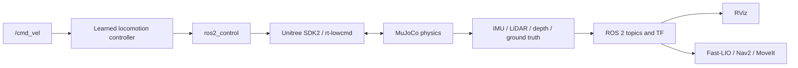

# Humanoid_ROS2

Native ROS 2 Jazzy simulation and autonomy development for the Unitree G1 humanoid.

This repository is an independent development copy derived from
[`maxwellrobotics/g1-ros2`](https://github.com/maxwellrobotics/g1-ros2). It targets Ubuntu 24.04
and runs directly on the host without Docker.

## What I changed in this version

This is not an untouched mirror of the upstream repository. My work on this version focuses on
making the project easier to install, understand, reproduce, and extend as a ROS 2 Jazzy learning
platform:

- Replaced the Docker and dev-container workflow with a native Ubuntu 24.04 / ROS 2 Jazzy setup.
- Added pinned, workspace-local builds for Unitree SDK2, Livox SDK2, MuJoCo, and ONNX Runtime.
- Moved generated dependencies, caches, simulator binaries, and ROS logs under `.native/`.
- Made Unitree SDK2, ONNX Runtime, simulator, and robot-mesh paths configurable instead of relying
  on fixed installation paths.
- Added native dependency, environment, build, launch, cleanup, and repository-copy scripts.
- Added a loopback-only CycloneDDS profile to isolate simulated Unitree motor traffic from physical
  network interfaces.
- Updated the ROS 2 external import flow for Jazzy and shallow source imports.
- Removed Docker-specific automation and large demo GIF files from the project history.
- Built and validated 14 ROS packages natively.
- Verified MuJoCo 3.3.6, the learned locomotion policy, controller activation, Dex3 simulation,
  live IMU data, RViz startup, and `/joint_states` near 200 Hz.
- Documented the engineering work required for a future Gazebo Harmonic backend.

Detailed migration notes are in [docs/JAZZY_MIGRATION.md](docs/JAZZY_MIGRATION.md). A ready-to-use
recording plan and narration are in [docs/LINKEDIN_DEMO.md](docs/LINKEDIN_DEMO.md).

## What you can learn from this repository

This project can be followed as a practical humanoid-robotics learning path:

1. How a humanoid URDF and meshes become a ROS robot description.
2. How `ros2_control` divides command ownership across legs, waist, arms, and hands.
3. How a learned ONNX policy runs inside a real-time-style controller loop.
4. How MuJoCo physics exchanges low-level state and commands with Unitree SDK2.
5. How IMU, LiDAR, depth, joint state, odometry, and TF data reach ROS 2.
6. How RViz, Fast-LIO, SLAM Toolbox, Nav2, and MoveIt consume that data.
7. How the same ROS interfaces can be kept while introducing another physics backend such as
   Gazebo Harmonic.



## Project status

| Capability | Status |
|---|---|
| ROS 2 Jazzy native build | Working |
| Unitree MuJoCo physics simulation | Working |
| `ros2_control` body and Dex3 interfaces | Working |
| Learned G1 locomotion controller | Working |
| RViz robot, TF, joint-state, and sensor visualization | Working |
| Fast-LIO, Nav2, MoveIt, and manipulation packages | Available |
| Gazebo Harmonic simulation | Planned; dependencies are installed, integration is not implemented yet |

The verified simulator is currently Unitree MuJoCo. Gazebo is not presented as working until its
control and sensor paths have been implemented and tested.

## Architecture

The stack uses:

- ROS 2 Jazzy on Ubuntu 24.04.
- `ros2_control` for body, arm, waist, and Dex3 hand controller ownership.
- A learned ONNX locomotion policy for G1 balance and velocity control.
- Unitree SDK2 DDS channels isolated to the loopback interface during simulation.
- MuJoCo for robot physics and simulated sensor sampling.
- RViz for ROS visualization.
- Fast-LIO, SLAM Toolbox, Nav2, MoveIt, and BehaviorTree.CPP for autonomy.

## Native installation

Requirements:

- x86-64 Ubuntu 24.04
- ROS 2 Jazzy installed in `/opt/ros/jazzy`
- Internet access during initial dependency setup
- Approximately 12 GB of free disk space

Run from the repository root:

```bash
./scripts/install-native-dependencies.sh
./scripts/import-externals.sh
./scripts/setup-native-jazzy.sh
./scripts/build-native-jazzy.sh
```

The setup keeps Unitree SDK2, Livox SDK2, ONNX Runtime, MuJoCo, caches, and downloaded source under
the ignored `.native/` directory. It does not place third-party project dependencies under `/opt`.

Source the environment in every new terminal:

```bash
source scripts/native-env.sh
```

## First learning lab

The shortest useful exercise is to launch the robot, inspect the control graph, and connect what
you see in MuJoCo to the ROS interfaces.

Terminal 1:

```bash
source scripts/native-env.sh
ros2 launch g1_bringup bringup.launch.py headless:=false
```

Terminal 2:

```bash
source scripts/native-env.sh
ros2 node list
ros2 control list_controllers
ros2 topic list -t
ros2 topic hz /joint_states
ros2 topic echo /imu_sensor_broadcaster/imu --once
```

Questions to answer while exploring:

- Which controllers are active, and which are intentionally inactive?
- Why does the locomotion policy own the legs while the arm trajectory controller waits?
- Which frame publishes the IMU measurement?
- What changes in the ROS graph when `sensors:=true` or `rviz:=true` is added?
- Which pieces are specific to MuJoCo, and which could remain unchanged with Gazebo?

## Run the current MuJoCo simulation

Open the MuJoCo viewer:

```bash
ros2 launch g1_bringup bringup.launch.py headless:=false
```

Run with simulated sensors and RViz:

```bash
ros2 launch g1_bringup bringup.launch.py \
  sensors:=true rviz:=true headless:=false odometry:=ground_truth
```

Run physics without a visible MuJoCo window:

```bash
ros2 launch g1_bringup bringup.launch.py headless:=true
```

The convenience wrapper exposes the same native workflow:

```bash
./scripts/manage.sh setup
./scripts/manage.sh build
./scripts/manage.sh sim headless:=false
```

### Verify the running simulation

In another terminal:

```bash
source scripts/native-env.sh
ros2 node list
ros2 control list_controllers
ros2 topic hz /joint_states
```

The bare simulation should publish `/joint_states` near 200 Hz. The learned locomotion controller,
locomotion safety controller, joint-state broadcaster, IMU broadcaster, arm freeze controller,
and waist freeze controller should be active.

## RViz

RViz is a visualization and interaction tool, not the physics engine. It can display the robot
model, joint states, TF, LiDAR point clouds, maps, Nav2 data, and MoveIt planning while MuJoCo—or a
future Gazebo backend—runs the physics.

## Gazebo Harmonic plan

ROS 2 Jazzy uses Gazebo Harmonic, and this development machine already has `ros_gz` and
[`gz_ros2_control`](https://control.ros.org/jazzy/doc/gz_ros2_control/doc/index.html). A proper
Gazebo backend still needs these project changes:

1. Add a Gazebo-specific G1 xacro using `gz_ros2_control/GazeboSimSystem` instead of the Unitree
   DDS hardware plugin.
2. Convert or recreate the MuJoCo MJCF scenes as Gazebo SDF worlds.
3. Spawn the G1 model and load the existing controller configuration through the
   `gz_ros2_control` system plugin.
4. Bridge Gazebo IMU, LiDAR, depth, clock, and ground-truth state into the ROS topic and TF
   contracts used by this stack.
5. Revalidate the learned locomotion policy against Gazebo contact dynamics and controller timing.
6. Add a dedicated `gazebo.launch.py` and simulation tests before declaring backend parity.

Gazebo support is feasible, but merely opening the URDF in Gazebo would not reproduce the current
walking, sensor, navigation, or manipulation behavior.

## Autonomy examples

Build the optional BehaviorTree orchestration package:

```bash
./scripts/build-native-jazzy.sh --full
source scripts/native-env.sh
```

Mapping:

```bash
ros2 launch g1_bringup bringup.launch.py mode:=mapping rviz:=true
```

Localization and Nav2:

```bash
ros2 launch g1_bringup bringup.launch.py \
  mode:=localization nav:=true rviz:=true
```

MoveIt with simulated perception:

```bash
ros2 launch g1_bringup bringup.launch.py \
  moveit:=true sensors:=true rviz:=true
```

Manipulation test world:

```bash
ros2 launch g1_bringup bringup.launch.py \
  moveit:=true manipulation:=true pin_pelvis:=true world:=manipulation \
  activate_arm:=true activate_arm_delay_s:=40.0 rviz:=true
```

## Main packages

| Package | Purpose |
|---|---|
| `g1_bringup` | MuJoCo, ROS control, sensors, and top-level launch files |
| `g1_description` | G1 URDF, meshes, and `ros2_control` model |
| `g1_controllers` | Learned locomotion, safety, and freeze controllers |
| `g1_hardware_interface` | Unitree DDS body interface for all 29 motors |
| `g1_hand_interface` | Dex3 hand interfaces |
| `g1_state_estimation` | Ground-truth and Fast-LIO odometry/TF |
| `g1_sensor_relay` | Simulated LiDAR, IMU, depth, and object data |
| `g1_navigation` | SLAM Toolbox, localization, and Nav2 |
| `g1_moveit_config` | MoveIt planning and RViz configuration |
| `g1_manipulation` | Pick-and-place actions |
| `g1_orchestration` | BehaviorTree.CPP mission execution |
| `g1_locomotion`, `g1_msgs` | Base approach actions and project interfaces |

## Safety

- Always source `scripts/native-env.sh` before simulation.
- The simulation profile pins Unitree CycloneDDS traffic to loopback.
- Never select a robot-facing network interface for simulation.
- Use `./scripts/clean-stack.sh` after a crashed or interrupted launch.
- Do not use the MuJoCo viewer's Reload button while simulated sensors are active.

## License and origin

The upstream BSD-3-Clause license and copyright notice are retained in [LICENSE](LICENSE).
See [ORIGIN.md](ORIGIN.md) for the source repository and commit. Third-party components retain
their own licenses.
