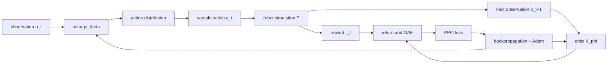
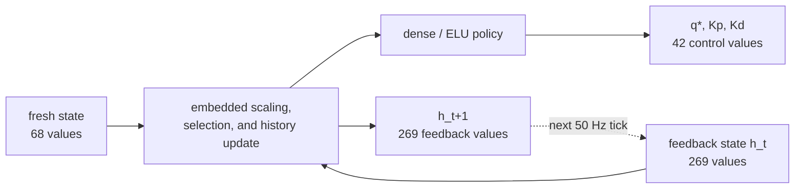
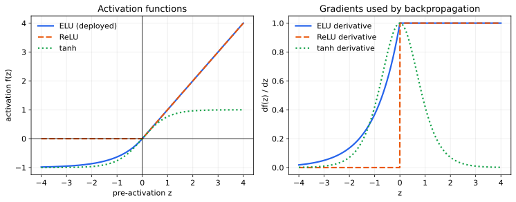
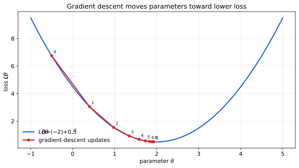
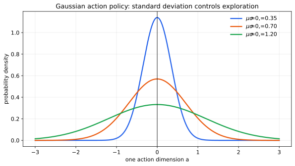
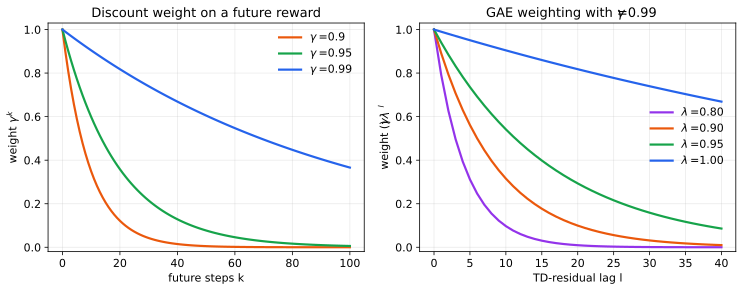
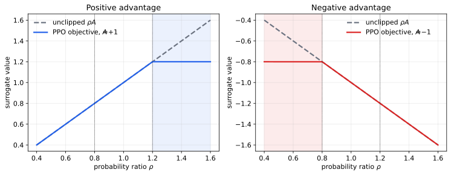
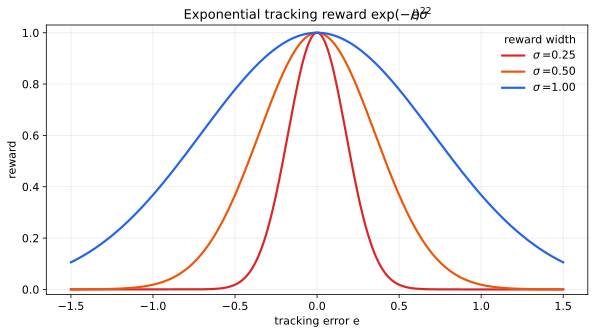
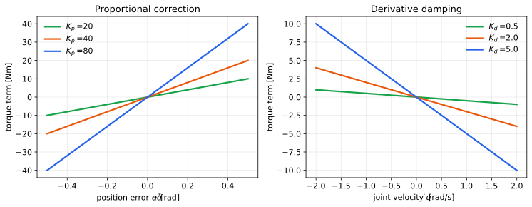

# The Mathematics Behind the G1 Locomotion Policy

## Neural networks, reinforcement learning, PPO, and robot control equations

This chapter collects the equations needed to understand the deep-learning system behind the G1
locomotion controller. It begins with the exact tensors and timing used by the deployed ONNX model,
then derives the neural-network and reinforcement-learning mathematics that can produce such a
policy.

“All equations” cannot mean every equation in the entire field of deep learning. It means the
complete working set needed to follow this project from robot state, through policy training and
inference, to a commanded joint response.

The labels below distinguish evidence from explanation:

- **Deployed:** directly verified in this repository's ONNX descriptor or C++ controller.
- **Training:** used by the upstream AGILE/RSL-RL training workflow, but not evaluated by this ROS
  inference process.
- **Foundation:** standard mathematics required to understand the deployed and training equations.

The companion chapter [From `/cmd_vel` to a Humanoid Gait](DEEP_RL_HUMANOID.md) explains the
engineering system and practical labs. This chapter concentrates on mathematics.

The mathematical learning loop can be read as a computational graph:



## 1. Symbols used throughout the chapter

| Symbol | Meaning |
|---|---|
| $t$ | Current timestep |
| $s_t$ | Full environment state at time $t$ |
| $o_t$ | Observation available to the policy |
| $a_t$ | Action produced by the policy |
| $r_t$ | Reward after taking an action |
| $\pi_\theta$ | Policy with trainable parameters $\theta$ |
| $V_\phi$ | Critic/value network with parameters $\phi$ |
| $q,\dot q$ | Joint position and joint velocity |
| $q^*$ | Desired joint position |
| $K_p,K_d$ | Proportional and derivative gains |
| $\gamma$ | Reward discount factor |
| $\lambda$ | GAE bias/variance parameter |
| $\epsilon$ | PPO clipping limit |
| $\alpha$ | Optimizer learning rate |
| $\mu,\sigma$ | Mean and standard deviation of a Gaussian policy |
| $\lVert x\rVert_2$ | Euclidean norm of vector $x$ |
| $\mathbb E[X]$ | Expected value of $X$ |

Vectors are written in lowercase bold meaning when context requires it, matrices in uppercase, and
scalars in ordinary lowercase. The code stores all policy tensors as `float32`.

## 2. Vectors, dot products, and matrix multiplication

### 2.1 A vector

**Foundation.** A robot observation is a vector of numbers:

$$
x = [x_1,x_2,\ldots,x_n]^T
$$

Its Euclidean length is:

$$
\lVert x\rVert_2 = \sqrt{\sum_{i=1}^{n}x_i^2}
$$

Squared norms appear often in tracking rewards and losses because they are non-negative and grow
quickly as error increases:

$$
\lVert x-y\rVert_2^2 = \sum_{i=1}^{n}(x_i-y_i)^2
$$

### 2.2 Dot product

**Foundation.** A neuron first forms a weighted sum:

$$
w^Tx = \sum_{i=1}^{n}w_i x_i
$$

Each weight controls how strongly one input contributes. A positive weight increases the result
when its input increases; a negative weight decreases it.

### 2.3 Dense layer

**Foundation and deployed.** A complete dense layer evaluates many neurons together:

$$
z^{(l)} = W^{(l)}h^{(l-1)} + b^{(l)}
$$

where $h^{(l-1)}$ is the previous layer, $W^{(l)}$ is the weight matrix, and $b^{(l)}$ is the bias.
The ONNX operator `Gemm` implements this affine transformation. The deployed graph contains four
`Gemm` operations.

### 2.4 Concatenation

**Deployed.** The policy combines different observation terms and flattened histories:

$$
x_t = o_t^{(1)} \oplus o_t^{(2)} \oplus \cdots \oplus h_t^{(k)}
$$

The symbol $\oplus$ means concatenate, not add. If one term has 3 elements and another has 14,
their concatenation has 17 elements.

## 3. Mean, variance, normalization, and clipping

### 3.1 Mean and variance

**Foundation.** For a batch of $N$ values:

$$
\mu_x = \frac{1}{N}\sum_{i=1}^{N}x_i
$$

$$
\sigma_x^2 = \frac{1}{N}\sum_{i=1}^{N}(x_i-\mu_x)^2
$$

The standard deviation is $\sigma_x=\sqrt{\sigma_x^2}$. These statistics describe the scale and
spread of observations, returns, or advantages.

### 3.2 Standardization

**Foundation and training.** A normalized value is:

$$
\hat x = \frac{x-\mu_x}{\sqrt{\sigma_x^2+\varepsilon}}
$$

The small $\varepsilon$ prevents division by zero. Normalization keeps quantities with different
units—such as radians, radians per second, and meters per second—from producing badly scaled neural
gradients.

### 3.3 Advantage normalization

**Training.** PPO commonly standardizes advantages within a training batch:

$$
\hat A_t = \frac{A_t-\mu_A}{\sigma_A+\varepsilon}
$$

This does not change whether an action was better or worse than average, but it produces a more
consistent optimization scale.

### 3.4 Clipping

**Foundation, deployed, and training.** Clipping restricts a scalar to an interval:

$$
\operatorname{clip}(x,l,u)=\min(\max(x,l),u)
$$

The ROS controller uses magnitude limits for velocity commands. PPO uses clipping for a different
reason: to limit policy updates.

## 4. G1 orientation mathematics

### 4.1 Unit quaternion

**Deployed.** The pelvis orientation is represented by:

$$
q_r=[w,x,y,z]^T
$$

A rotation quaternion must have unit norm:

$$
\lVert q_r\rVert_2 = \sqrt{w^2+x^2+y^2+z^2}=1
$$

ROS exposes IMU components as `x,y,z,w`, while this policy expects `w,x,y,z`. Reordering is not a
mathematical operation on orientation; it is an interface conversion that must happen before the
equations use the quaternion.

### 4.2 Quaternion rotation matrix

**Foundation.** For a normalized quaternion in `w,x,y,z` order:

$$
R(q_r)=
\begin{bmatrix}
1-2(y^2+z^2) & 2(xy-wz) & 2(xz+wy) \\
2(xy+wz) & 1-2(x^2+z^2) & 2(yz-wx) \\
2(xz-wy) & 2(yz+wx) & 1-2(x^2+y^2)
\end{bmatrix}
$$

$R$ maps a vector from the body frame to the world frame. Its transpose maps the other way when
$R$ is a proper rotation matrix.

### 4.3 Projected gravity

**Deployed.** Let world gravity direction be:

$$
g_w=[0,0,-1]^T
$$

Gravity expressed in the pelvis/body frame is:

$$
g_b = R(q_r)^T g_w
$$

When the pelvis is upright, $g_b$ is close to `[0,0,-1]`. Roll and pitch change its first two
components, giving the policy a direct balance signal without requiring Euler-angle discontinuities.

## 5. Exact deployed observation equation

### 5.1 Fresh observation

**Deployed.** The five fresh inputs are:

$$
o_t = q_r \oplus \omega_t^b \oplus c_t \oplus q_t^{all} \oplus \dot q_t^{all}
$$

with:

$$
c_t=[v_x^{cmd},v_y^{cmd},\omega_z^{cmd}]^T
$$

Their shapes and element counts are:

$$
4+3+3+29+29=68
$$

The policy observes all 29 body joints. Its learned action controls 14 lower-body/waist joints.

### 5.2 Command timeout

**Deployed.** If the most recent `/cmd_vel` timestamp is too old, the command becomes zero:

$$
c_t=
\begin{cases}
[v_x,v_y,\omega_z]^T,& t-t_{cmd}\leq 0.5\ \text{s} \\
[0,0,0]^T,& t-t_{cmd}>0.5\ \text{s}
\end{cases}
$$

This equation turns communication silence into a stop request.

### 5.3 Five-step history

**Deployed.** For an observation term $u_t$, a history of length five is:

$$
H_t^u=[u_{t-4},u_{t-3},u_{t-2},u_{t-1},u_t]
$$

The next history drops the oldest sample and appends the newest:

$$
H_{t+1}^u=[H_t^u[1],H_t^u[2],H_t^u[3],H_t^u[4],u_{t+1}]
$$

The stateful inputs are:

$$
h_t=a_{t-1}\oplus H_t^{\omega}\oplus H_t^g\oplus H_t^c
\oplus H_t^q\oplus H_t^{\dot q}\oplus H_t^a
$$

Their element count is:

$$
14+(5\cdot3)+(5\cdot3)+(5\cdot3)+(5\cdot14)+(5\cdot14)+(5\cdot14)=269
$$

Together, the 12 ONNX input tensors contain:

$$
68+269=337\ \text{floating-point values}
$$

The graph returns the updated 269 state values for feedback into the next call.



### 5.4 History duration

**Deployed.** The controller manager runs at 200 Hz and the policy uses decimation 4:

$$
f_{policy}=\frac{f_{control}}{d}=\frac{200}{4}=50\ \text{Hz}
$$

$$
\Delta t_{policy}=\frac{1}{50}=0.02\ \text{s}
$$

Five stored samples occupy five control bins:

$$
T_H=5\Delta t_{policy}=0.10\ \text{s}
$$

The timestamp separation from the oldest sample to the newest is four intervals:

$$
T_{oldest\rightarrow newest}=(5-1)\Delta t_{policy}=0.08\ \text{s}
$$

This is why changing decimation changes the physical meaning of history.

## 6. The deployed neural-network forward pass

### 6.1 ELU activation

**Deployed.** The exported graph contains three ELU activation operations. With the graph's
$\alpha=1$:

$$
\operatorname{ELU}(z)=
\begin{cases}
z,&z>0 \\
e^z-1,&z\leq0
\end{cases}
$$

Its derivative, used during training backpropagation, is:

$$
\frac{d\operatorname{ELU}}{dz}=
\begin{cases}
1,&z>0 \\
e^z,&z\leq0
\end{cases}
$$

Unlike ReLU, ELU produces smooth negative values and non-zero gradients on its negative branch.



*The deployed actor uses ELU. The right-hand graph shows why ELU can still propagate a gradient
for negative pre-activations, unlike ReLU's zero-gradient branch.*

### 6.2 Four-layer policy mapping

**Deployed.** After the graph constructs and scales its feature vector $x_t$, the visible dense
sequence is:

$$
h_1=\operatorname{ELU}(W_1x_t+b_1)
$$

$$
h_2=\operatorname{ELU}(W_2h_1+b_2)
$$

$$
h_3=\operatorname{ELU}(W_3h_2+b_3)
$$

$$
a_t^{raw}=W_4h_3+b_4
$$

The learned matrices and biases are stored inside the ONNX artifact. The ROS controller does not
change them. The surrounding end-to-end graph converts $a_t^{raw}$ into absolute joint targets and
constructs the controller-facing outputs. The dense layer should not be assumed to generate every
gain directly; constants and graph transformations can also be part of an exported ONNX graph.

### 6.3 Output partition

**Deployed.** The direct control output has 42 values:

$$
y_t^{control}=q_t^*\oplus K_{p,t}\oplus K_{d,t}
$$

$$
14+14+14=42
$$

The graph also returns 269 feedback-state values, so its 10 output tensors contain 311 values in
total:

$$
42+269=311
$$

The graph applies its own input preprocessing, action scaling, and default-pose offset. Therefore
$q_t^*$ is already an absolute radian target when C++ receives it.

## 7. Backpropagation: how weights learn

Inference only evaluates the equations above. Training adjusts $W$ and $b$ to reduce a loss.

### 7.1 Chain rule

**Foundation and training.** If loss $L$ depends on $z$, and $z$ depends on weight $w$:

$$
\frac{\partial L}{\partial w}=
\frac{\partial L}{\partial z}
\frac{\partial z}{\partial w}
$$

Across several layers:

$$
\frac{\partial L}{\partial W_l}=
\frac{\partial L}{\partial h_L}
\frac{\partial h_L}{\partial h_{L-1}}
\cdots
\frac{\partial h_l}{\partial W_l}
$$

Backpropagation is an efficient organization of this repeated chain rule.

### 7.2 Mean-squared error

**Foundation and training.** For regression or distillation targets:

$$
L_{MSE}=\frac{1}{N}\sum_{i=1}^{N}(\hat y_i-y_i)^2
$$

Its derivative with respect to a prediction is:

$$
\frac{\partial L_{MSE}}{\partial \hat y_i}=\frac{2}{N}(\hat y_i-y_i)
$$

The gradient points in the direction that increases error; optimization moves in the negative
gradient direction.

### 7.3 Gradient descent

**Foundation and training.** Basic gradient descent updates parameters using:

$$
\theta_{k+1}=\theta_k-\alpha\nabla_\theta L(\theta_k)
$$

$\alpha$ is the learning rate. A value that is too large can destabilize learning; one that is too
small can make it impractically slow.

### 7.4 Adam

**Training.** Adam keeps moving averages of the gradient and squared gradient:

$$
g_k=\nabla_\theta L(\theta_k)
$$

$$
m_k=\beta_1m_{k-1}+(1-\beta_1)g_k
$$

$$
v_k=\beta_2v_{k-1}+(1-\beta_2)g_k^2
$$

Bias correction gives:

$$
\hat m_k=\frac{m_k}{1-\beta_1^k},\qquad
\hat v_k=\frac{v_k}{1-\beta_2^k}
$$

The update is:

$$
\theta_{k+1}=\theta_k-
\alpha\frac{\hat m_k}{\sqrt{\hat v_k}+\varepsilon}
$$

Adam adapts the effective step size separately for each parameter.



*The numbered points show repeated parameter updates. A neural network has many parameters, so its
loss is a high-dimensional surface, but the update principle is the same.*

## 8. Reinforcement-learning objective

### 8.1 Markov decision process

**Foundation and training.** An environment transition is sampled from:

$$
s_{t+1}\sim P(s_{t+1}\mid s_t,a_t)
$$

The policy samples an action from:

$$
a_t\sim\pi_\theta(a_t\mid o_t)
$$

Because the actor does not receive every simulator variable, $o_t$ is not necessarily the full
state $s_t$. History helps with this partial observability.

### 8.2 Discounted return

**Foundation and training.** The return from timestep $t$ is:

$$
G_t=\sum_{k=0}^{T-t-1}\gamma^k r_{t+k}
$$

The learning objective is expected return:

$$
J(\theta)=\mathbb E_{\tau\sim\pi_\theta}\left[G_0\right]
$$

where trajectory $\tau=(s_0,a_0,r_0,s_1,\ldots)$ is generated by the current policy and simulator.

### 8.3 Value, action-value, and advantage

**Foundation and training.** The value function predicts return from a state:

$$
V^\pi(s_t)=\mathbb E_\pi[G_t\mid s_t]
$$

The action-value function also conditions on the selected action:

$$
Q^\pi(s_t,a_t)=\mathbb E_\pi[G_t\mid s_t,a_t]
$$

Advantage measures whether an action is better than the policy's normal expectation:

$$
A^\pi(s_t,a_t)=Q^\pi(s_t,a_t)-V^\pi(s_t)
$$

Positive advantage increases the probability of an action; negative advantage decreases it.

### 8.4 Bellman equation

**Foundation and training.** Values satisfy the recursive relationship:

$$
V^\pi(s_t)=\mathbb E_\pi\left[r_t+\gamma V^\pi(s_{t+1})\right]
$$

This equation connects an immediate reward to predicted future return.

## 9. Continuous Gaussian policy

Robot actions are continuous. A common PPO actor produces a mean vector and learns or predicts a
standard-deviation vector.

### 9.1 Action distribution

**Training.** For a diagonal Gaussian:

$$
\pi_\theta(a_t\mid o_t)=\mathcal N
\left(\mu_\theta(o_t),\operatorname{diag}(\sigma_\theta^2)\right)
$$

An action can be sampled through reparameterization:

$$
a_t=\mu_\theta(o_t)+\sigma_\theta\odot\epsilon,
\qquad\epsilon\sim\mathcal N(0,I)
$$

$\odot$ is element-wise multiplication. During deterministic evaluation, the mean action is often
used:

$$
a_t=\mu_\theta(o_t)
$$

The deployed ONNX output is deterministic for identical inputs and history; exploration noise is
not added by the ROS controller.

### 9.2 Log probability

**Training.** For $d$ independent action dimensions:

$$
\log\pi_\theta(a\mid o)=
-\frac{1}{2}\sum_{i=1}^{d}
\left[
\frac{(a_i-\mu_i)^2}{\sigma_i^2}
+2\log\sigma_i+\log(2\pi)
\right]
$$

PPO uses log probabilities to compare the new policy with the policy that collected a rollout.

### 9.3 Gaussian entropy

**Training.** The entropy of a diagonal Gaussian is:

$$
\mathcal H(\pi)=
\frac{1}{2}\sum_{i=1}^{d}
\log(2\pi e\sigma_i^2)
$$

Higher entropy means more exploration. Too little can cause early convergence; too much leaves the
actions noisy.



*All three policies have the same mean action. Increasing $\sigma$ spreads probability over a
wider action range, illustrating the exploration controlled by policy variance and entropy.*

## 10. Policy gradient

**Foundation and training.** The policy-gradient theorem gives an estimator of how expected return
changes with policy parameters:

$$
\nabla_\theta J(\theta)=
\mathbb E_{\pi_\theta}
\left[
\nabla_\theta\log\pi_\theta(a_t\mid o_t)A_t
\right]
$$

The log-probability gradient changes the probability of the sampled action. The advantage supplies
the direction: increase probability when $A_t>0$, decrease it when $A_t<0$.

## 11. Temporal-difference error and GAE

### 11.1 One-step TD residual

**Training.** The temporal-difference residual is:

$$
\delta_t=r_t+\gamma(1-d_t)V_\phi(s_{t+1})-V_\phi(s_t)
$$

$d_t=1$ for a true terminal state and zero otherwise. The terminal mask prevents bootstrapping
through a state after the episode has ended.

### 11.2 Generalized Advantage Estimation

**Training.** GAE accumulates discounted TD residuals:

$$
\hat A_t^{GAE(\gamma,\lambda)}=
\sum_{l=0}^{T-t-1}(\gamma\lambda)^l\delta_{t+l}
$$

The equivalent backward recursion is:

$$
\hat A_t=\delta_t+\gamma\lambda(1-d_t)\hat A_{t+1}
$$

The return target for the critic is:

$$
\hat R_t=\hat A_t+V_\phi(s_t)
$$

$\lambda$ trades bias against variance. Lower values trust the critic more; values near one use
longer sampled returns.



*The left graph shows how $\gamma$ controls the importance of distant rewards. The right graph
shows how $\lambda$ changes the contribution of older TD residuals to the current advantage.*

## 12. PPO equations

The upstream AGILE framework uses the RSL-RL reinforcement-learning backend. PPO's central idea is
to improve the policy without allowing one optimization batch to move it too far.

### 12.1 Probability ratio

**Training.** The new-to-old probability ratio is:

$$
\rho_t(\theta)=
\frac{\pi_\theta(a_t\mid o_t)}
{\pi_{\theta_{old}}(a_t\mid o_t)}
$$

Using log probabilities is numerically convenient:

$$
\rho_t(\theta)=
\exp\left(
\log\pi_\theta(a_t\mid o_t)-
\log\pi_{\theta_{old}}(a_t\mid o_t)
\right)
$$

### 12.2 Clipped surrogate objective

**Training.** PPO maximizes:

$$
L^{clip}(\theta)=
\mathbb E_t\left[
\min\left(
\rho_t(\theta)\hat A_t,
\operatorname{clip}(\rho_t(\theta),1-\epsilon,1+\epsilon)\hat A_t
\right)
\right]
$$

When a beneficial action has already become much more likely, or a harmful action much less
likely, clipping prevents that sample from continuing to push the policy strongly.



*For positive advantage, PPO stops rewarding a probability increase beyond $1+\epsilon$. For
negative advantage, it stops rewarding a probability decrease below $1-\epsilon$. The unclipped
side remains available when the update moves in the wrong direction.*

Implementations that minimize loss use the negative form:

$$
L_{actor}=-L^{clip}
$$

### 12.3 Value loss

**Training.** A basic critic loss is:

$$
L_V(\phi)=\mathbb E_t
\left[(V_\phi(s_t)-\hat R_t)^2\right]
$$

With PPO-style value clipping:

$$
V_{clip}=V_{old}+
\operatorname{clip}(V_\phi-V_{old},-\epsilon_v,+\epsilon_v)
$$

$$
L_V^{clip}=\mathbb E_t\left[
\max\left(
(V_\phi-\hat R_t)^2,
(V_{clip}-\hat R_t)^2
\right)
\right]
$$

### 12.4 Entropy bonus and total loss

**Training.** A typical total loss minimized by PPO is:

$$
L_{total}=L_{actor}+c_vL_V-c_H\mathbb E_t[\mathcal H(\pi_\theta)]
$$

$c_v$ weights critic learning and $c_H$ rewards exploration. Some configurations add symmetry,
regularization, or distillation losses:

$$
L=L_{total}+c_{sym}L_{sym}+c_{reg}L_{reg}+c_{distill}L_{distill}
$$

Exact coefficients are experiment configuration, not universal constants.

## 13. Locomotion reward equations

The equations in this section are standard, interpretable templates for understanding reward
design. They are **not asserted to be the exact reward and weights used to train the shipped ONNX
artifact**. The original training configuration is the authority for that claim.

### 13.1 Weighted total reward

**Training concept.** A reward is a weighted sum of task, style, and regularization terms:

$$
r_t=\sum_iw_ir_i(s_t,a_t,s_{t+1})
$$

### 13.2 Linear-velocity tracking

$$
e_v=\begin{bmatrix}v_x-v_x^{cmd}\\v_y-v_y^{cmd}\end{bmatrix}
$$

$$
r_{lin}=\exp\left(-\frac{\lVert e_v\rVert_2^2}{\sigma_v^2}\right)
$$

The exponential gives maximum reward at zero error and decays smoothly as tracking worsens.

### 13.3 Yaw-rate tracking

$$
e_\omega=\omega_z-\omega_z^{cmd}
$$

$$
r_{yaw}=\exp\left(-\frac{e_\omega^2}{\sigma_\omega^2}\right)
$$

### 13.4 Upright-orientation reward

Using projected gravity:

$$
e_g=g_b-[0,0,-1]^T
$$

$$
r_{upright}=\exp\left(-\frac{\lVert e_g\rVert_2^2}{\sigma_g^2}\right)
$$

### 13.5 Height tracking

$$
r_h=\exp\left(-\frac{(h-h^*)^2}{\sigma_h^2}\right)
$$

### 13.6 Torque and energy penalties

$$
p_\tau=\sum_{j=1}^{n}\tau_j^2
$$

Approximate mechanical power magnitude is:

$$
p_{power}=\sum_{j=1}^{n}|\tau_j\dot q_j|
$$

These terms discourage unnecessarily aggressive actuation.

### 13.7 Joint velocity and acceleration penalties

$$
p_{vel}=\sum_{j=1}^{n}\dot q_j^2
$$

With timestep $\Delta t$:

$$
\ddot q_t\approx\frac{\dot q_t-\dot q_{t-1}}{\Delta t}
$$

$$
p_{acc}=\sum_{j=1}^{n}\ddot q_j^2
$$

### 13.8 Action-rate and action-acceleration penalties

$$
p_{\Delta a}=\lVert a_t-a_{t-1}\rVert_2^2
$$

$$
p_{\Delta^2a}=\lVert a_t-2a_{t-1}+a_{t-2}\rVert_2^2
$$

These penalize jitter in the policy itself rather than relying on simulator damping to hide it.

### 13.9 Joint-limit penalty

For lower and upper limits $q_j^{min},q_j^{max}$:

$$
p_{limit}=\sum_j
\left[
\max(0,q_j^{min}-q_j)^2+
\max(0,q_j-q_j^{max})^2
\right]
$$

### 13.10 Foot-slip penalty

Let $c_f$ be one when foot $f$ is in contact and $v_{f,xy}$ its planar speed:

$$
p_{slip}=\sum_{f\in feet}c_f\lVert v_{f,xy}\rVert_2^2
$$

The penalty applies only while a foot should be stationary against the ground.

### 13.11 Survival and termination

$$
r_{alive}=1
$$

$$
r_{terminal}=
\begin{cases}
-C_{fall},&\text{true failure}\\
0,&\text{otherwise}
\end{cases}
$$

Time-limit truncation must be distinguished from a physical failure so the critic handles
bootstrapping correctly.

### 13.12 Example combined reward

$$
r_t=w_vr_{lin}+w_\omega r_{yaw}+w_ur_{upright}+w_hr_h+w_ar_{alive}
-w_\tau p_\tau-w_pp_{power}-w_sp_{slip}-w_{\Delta a}p_{\Delta a}-w_lp_{limit}
$$

Every coefficient encodes a design tradeoff. Reward curves must be checked against real metrics to
detect reward hacking.



*A smaller $\sigma$ creates a narrow reward peak and demands precise tracking. A larger $\sigma$
provides a broader learning signal but distinguishes small errors less strongly.*

## 14. Teacher–student distillation

The upstream AGILE framework supports privileged teacher policies and deployable students. A
teacher may observe simulator-only information such as contact forces or exact velocities. The
student receives only signals available at deployment, often with history.

### 14.1 Action regression

**Training.** A deterministic distillation loss is:

$$
L_{distill}=\mathbb E_t
\left[\lVert\pi_S(o_t,h_t)-\pi_T(s_t^{priv})\rVert_2^2\right]
$$

### 14.2 Distribution matching

For stochastic policies, one may minimize KL divergence:

$$
D_{KL}(\pi_T\Vert\pi_S)=
\mathbb E_{a\sim\pi_T}
\left[
\log\frac{\pi_T(a\mid s^{priv})}{\pi_S(a\mid o,h)}
\right]
$$

Distillation explains why observation history is valuable: it helps a student infer hidden state
without privileged simulator measurements.

## 15. Domain randomization equation

Let $\xi$ represent randomized physics parameters such as mass, friction, delay, or motor strength:

$$
\xi\sim p(\xi)
$$

Training optimizes performance across that distribution:

$$
J(\theta)=
\mathbb E_{\xi\sim p(\xi),\ \tau\sim\pi_\theta,P_\xi}
\left[
\sum_t\gamma^tr_t
\right]
$$

The policy must find behavior that works for many plausible robots rather than exploiting one
simulator parameter set.

## 16. From policy output to motor response

### 16.1 PD impedance command

**Deployed.** For each commanded joint:

$$
\tau_j=K_{p,j}(q_j^*-q_j)+K_{d,j}(\dot q_j^*-\dot q_j)+\tau_j^{ff}
$$

The deployed controller writes:

$$
\dot q_j^*=0,\qquad\tau_j^{ff}=0
$$

so:

$$
\tau_j=K_{p,j}(q_j^*-q_j)-K_{d,j}\dot q_j
$$



*The proportional term grows with position error. The derivative term opposes velocity, which is
why its slope is negative. Larger gains create stronger responses.*

### 16.2 Safety blending

**Deployed concept.** When the learned controller activates, its target is blended from the held
pose $q^{hold}$:

$$
q^{safe}=(1-\beta)q^{hold}+\beta q^{policy},\qquad0\leq\beta\leq1
$$

If blend speed is limited, the general update toward a requested ratio is:

$$
\beta_{t+1}=\beta_t+
\operatorname{clip}
(\beta_{requested}-\beta_t,-\dot\beta_{max}\Delta t,+\dot\beta_{max}\Delta t)
$$

### 16.3 Joint target slew limit

For a maximum target rate $v_j^{max}$:

$$
q_{j,t}^{limited}=q_{j,t-1}^{safe}+
\operatorname{clip}
(q_{j,t}^{safe}-q_{j,t-1}^{safe},-v_j^{max}\Delta t,+v_j^{max}\Delta t)
$$

The actual configuration can deliberately leave a balance policy unclamped where fast corrections
are required; the equation explains the available mechanism.

## 17. Evaluation equations

### 17.1 Velocity-tracking RMSE

$$
RMSE_v=\sqrt{\frac{1}{T}\sum_{t=1}^{T}
\lVert v_t-v_t^{cmd}\rVert_2^2}
$$

### 17.2 Mean absolute tracking error

$$
MAE_v=\frac{1}{T}\sum_{t=1}^{T}|v_t-v_t^{cmd}|
$$

### 17.3 Fall rate

$$
R_{fall}=\frac{N_{fallen\ episodes}}{N_{total\ episodes}}
$$

### 17.4 Mean action change

$$
S_a=\frac{1}{T-1}\sum_{t=2}^{T}\lVert a_t-a_{t-1}\rVert_2
$$

### 17.5 Real-time budget utilization

At a 200 Hz control rate, the update budget is 5 ms. If inference takes $t_{infer}$:

$$
U_{infer}=\frac{t_{infer}}{5\ \text{ms}}\times100\%
$$

The controller documentation reports a measured mean inference time of 0.056 ms:

$$
U_{infer}\approx\frac{0.056}{5}\times100\%=1.12\%
$$

Its reported maximum of 0.319 ms corresponds to:

$$
U_{infer,max}\approx\frac{0.319}{5}\times100\%=6.38\%
$$

Those percentages cover inference alone, not the entire ROS control update.

## 18. Worked numerical examples

### 18.1 One neuron

Suppose:

$$
x=[0.2,-0.5,1.0]^T,\quad
w=[0.4,0.1,-0.3]^T,\quad b=0.2
$$

Then:

$$
z=w^Tx+b=(0.4)(0.2)+(0.1)(-0.5)+(-0.3)(1.0)+0.2=-0.07
$$

With ELU:

$$
h=e^{-0.07}-1\approx-0.0676
$$

### 18.2 One PD-controlled joint

Let:

$$
q^*=0.5,\quad q=0.4,\quad\dot q=0.2,\quad K_p=40,\quad K_d=2
$$

Then:

$$
\tau=40(0.5-0.4)-2(0.2)=4-0.4=3.6
$$

The motor receives a positive command because position error dominates the damping term.

### 18.3 Five-step GAE recursion

For one step with $r_t=1$, $V(s_t)=2.0$, $V(s_{t+1})=2.2$, $\gamma=0.99$, and no termination:

$$
\delta_t=1+0.99(2.2)-2.0=1.178
$$

If $\lambda=0.95$ and the next advantage estimate is $0.5$:

$$
\hat A_t=1.178+(0.99)(0.95)(0.5)=1.64825
$$

This positive advantage tells PPO that the sampled action performed better than the critic
expected.

## 19. Equations that are common in deep learning but not central here

These activations and losses are worth recognizing, although the deployed actor graph uses ELU and
continuous outputs rather than a classifier.

### ReLU

$$
\operatorname{ReLU}(z)=\max(0,z)
$$

### Sigmoid

$$
\sigma(z)=\frac{1}{1+e^{-z}}
$$

### Hyperbolic tangent

$$
\tanh(z)=\frac{e^z-e^{-z}}{e^z+e^{-z}}
$$

### Softmax

$$
p_i=\frac{e^{z_i}}{\sum_je^{z_j}}
$$

### Cross-entropy

$$
L_{CE}=-\sum_iy_i\log p_i
$$

Softmax and cross-entropy are mainly used for discrete classification. The G1 locomotion action is
continuous, so Gaussian policy equations are more relevant.

## 20. Equation-to-code map

| Mathematics | Project location |
|---|---|
| Fresh observation $o_t$ | `g1_controllers/src/g1_agile_controller.cpp` |
| Command timeout $c_t$ | `g1_controllers/src/g1_agile_controller.cpp` |
| Tensor shapes and history $h_t$ | `g1_controllers/include/g1_controllers/agile_policy.hpp` |
| ONNX forward pass $\pi(o,h)$ | `g1_controllers/src/agile_policy.cpp` |
| 50/200 Hz decimation | `g1_controllers/config/lowcmd_controllers.yaml` |
| Policy output $q^*,K_p,K_d$ | `g1_controllers/src/g1_agile_controller.cpp` |
| Blend, slew, and divergence safety | `g1_controllers/src/g1_safety_controller.cpp` |
| Tensor descriptor | `g1_controllers/policy/unitree_g1_velocity_e2e.yaml` |
| Contract validation | `g1_controllers/test/test_agile_policy.cpp` |

All paths in the table are relative to `workspace/src/`.

## 21. Recommended order for studying the equations

1. Work through vector norms, matrix multiplication, and dense layers.
2. Calculate quaternion projected gravity by hand for an upright and tilted pelvis.
3. Reconstruct the 337 deployed input values from the tensor table.
4. Follow the four dense-layer and ELU equations as one forward pass.
5. Calculate the PD torque example and change $K_p$ and $K_d$.
6. Learn returns, values, advantages, and the Bellman equation.
7. Work through TD residual and GAE calculations.
8. Calculate a PPO probability ratio and see when clipping becomes active.
9. Implement the reward templates in a small continuous-control environment.
10. Compare a PyTorch forward pass with exported ONNX inference.

Understanding means being able to calculate a small example and explain the physical consequence,
not only recognizing the notation.

## Reproducing the graphs

The plots are generated from their equations rather than edited by hand:

```bash
python3 scripts/generate_math_figures.py
```

The script writes deterministic SVG assets under `docs/media/math/`. SVG keeps equations, axes,
and curves sharp when the chapter is viewed at different sizes on GitHub.

## Primary references

- [NVIDIA WBC-AGILE repository](https://github.com/nvidia-isaac/WBC-AGILE)
- [AGILE: A Comprehensive Workflow for Humanoid Loco-Manipulation Learning](https://arxiv.org/abs/2603.20147)
- [Proximal Policy Optimization Algorithms](https://arxiv.org/abs/1707.06347)
- [High-Dimensional Continuous Control Using Generalized Advantage Estimation](https://arxiv.org/abs/1506.02438)
- [Adam: A Method for Stochastic Optimization](https://arxiv.org/abs/1412.6980)
