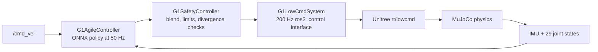

# From `/cmd_vel` to a Humanoid Gait

## An applied introduction to deep reinforcement learning with the Unitree G1

This chapter explains the machine-learning knowledge behind the learned locomotion controller in
this repository. The goal is not merely to run an ONNX file. The goal is to understand what the
policy observes, why it needs temporal history, what it commands, how reinforcement learning can
produce that behavior, and how ROS 2 turns a neural-network output into safe simulated motion.

The reader is assumed to know basic Python and the main ROS 2 concepts: nodes, topics, messages,
TF, launch files, and controllers. No previous experience with reinforcement learning or ONNX is
required.

For a derivation-focused treatment, use the companion chapter
[The Mathematics Behind the G1 Locomotion Policy](DEEP_LEARNING_MATHEMATICS.md). It collects and
explains the neural-network, backpropagation, Adam, Gaussian policy, value, GAE, PPO, reward,
quaternion, PD-control, safety, and evaluation equations used to understand this system.

> **Scope and evidence:** this repository contains NVIDIA's deployed WBC-AGILE policy artifact,
> its tensor descriptor, and the C++ inference and safety integration. It does not contain the
> original training environment, reward implementation, or optimizer configuration. This chapter
> identifies facts that can be verified from the deployed stack and treats training-side designs
> as concepts to study rather than undocumented claims about the original training run.

## 1. The problem the policy solves

A mobile base can often convert `/cmd_vel` into wheel velocities using geometry. A humanoid has a
much harder problem. A request such as “move forward at 0.3 m/s” does not specify where either foot
should land, how the knees should bend, or how the torso should move to prevent a fall.

The locomotion policy learns this missing mapping:

```text
desired body velocity + measured robot state
                    ↓
             neural policy
                    ↓
      coordinated lower-body joint targets
```

This is a feedback-control problem. The policy does not generate one fixed walking animation. It
receives new sensor and joint data at every policy step, then modifies its targets in response to
the current motion of the robot.

The high-level command is:

$$
c_t = [v_x, v_y, \omega_z]
$$

where $v_x$ is forward velocity, $v_y$ is lateral velocity, and $\omega_z$ is yaw rate. In
this stack those three values come from `/cmd_vel`. They may be published by a human, a test node,
or Nav2.

## 2. The complete control path

The learned model is one component in a larger system:



Each block has a different responsibility:

- `G1AgileController` prepares observations, runs inference, and writes learned targets.
- `G1SafetyController` decides how much of the learned command is trusted and detects divergence.
- `G1LowCmdSystem` converts ROS control interfaces into Unitree's low-level command message.
- MuJoCo integrates the robot dynamics and returns the next state.

This separation matters. A neural network is not a hardware driver, and a hardware driver should
not hide control policy. Keeping them separate makes the policy testable and gives the system a
place to enforce safety independently of machine learning.

## 3. Two clocks: physics at 200 Hz and policy at 50 Hz

The controller manager runs every 0.005 seconds:

$$
f_{control} = \frac{1}{0.005} = 200\ \text{Hz}
$$

The neural policy runs once every four controller updates:

$$
f_{policy} = \frac{200}{4} = 50\ \text{Hz}
$$

This ratio is called **decimation**. Between policy evaluations, the command interfaces retain the
most recent targets. The physics and low-level controller therefore continue at 200 Hz while the
more expensive high-level decision is refreshed at 50 Hz.

The policy rate is part of the learned contract, not an arbitrary performance setting. A history
of five samples at 50 Hz covers approximately 0.1 seconds. Running that same history at a different
rate changes the physical duration represented by the input and can make the learned behavior
incorrect even when every tensor shape still matches.

## 4. What the neural network observes

In reinforcement learning, the values given to the agent are called the **observation**. At time
$t$, the fresh observation used here is:

$$
o_t = [q^{root}_t,\ \omega^{root}_t,\ c_t,\ q^{joint}_t,\ \dot q^{joint}_t]
$$

The terms have the following meanings:

| Input | Shape | Meaning |
|---|---:|---|
| `root_link_quat_w` | `[1, 4]` | Pelvis orientation as a quaternion in `w,x,y,z` order |
| `root_ang_vel_b` | `[1, 3]` | Pelvis angular velocity in the body frame |
| `velocity_commands` | `[1, 3]` | Requested `v_x`, `v_y`, and `w_z` |
| `joint_pos` | `[1, 29]` | Position of every body motor |
| `joint_vel` | `[1, 29]` | Velocity of every body motor |

### Orientation and projected gravity

A humanoid must know which way is up. The root quaternion describes the pelvis orientation. Inside
the end-to-end graph it can be transformed into projected gravity: the gravity direction expressed
in the robot's body frame. When the torso tilts, the projected-gravity vector changes, providing a
compact signal that the policy can use for balance corrections.

Quaternions require careful ordering. ROS control exposes the IMU orientation as `x,y,z,w`, while
the model expects `w,x,y,z`. The controller maps these fields deliberately. A silent ordering
mistake would produce valid-looking numbers that describe the wrong orientation.

### Why all 29 joints are observed

The policy commands only the lower body and two waist joints, but it observes all 29 body joints.
Arm motion changes momentum and the distribution of mass. Observing the arms allows the balance
policy to react while MoveIt controls them independently.

Joint order is also part of the model contract. The model's observation order, action order, and
Unitree motor order are not identical. The implementation maps joints by name rather than assuming
that index 7 has the same meaning everywhere.

## 5. Why the policy has memory

One sensor snapshot cannot always explain how a robot arrived at its current state. Locomotion is
temporal: the same joint angles can occur while a leg is moving forward or backward. History helps
the model distinguish those situations.

The ONNX graph receives five samples of:

- base angular velocity;
- projected gravity;
- velocity commands;
- the 14 controlled-joint positions;
- the 14 controlled-joint velocities; and
- previous actions.

It also receives the last action separately. Seven of the twelve model inputs are state tensors.
The graph emits updated versions of those tensors, and the C++ runner feeds them directly into the
next inference call:

$$
(a_t, h_{t+1}) = \pi(o_t, h_t)
$$

Here $h_t$ is the carried history. This makes the exported model stateful even though the C++
wrapper does not maintain separate ring buffers. When the controller is reactivated,
`AgilePolicy::reset()` clears the history so a new episode does not inherit motion from an old one.

This is an example of **partial observability**. The complete physical state of the world is not
given directly to the agent, so recent observations help it estimate what is happening.

## 6. What the network produces

The policy produces three 14-element vectors:

| Output | Shape | Meaning |
|---|---:|---|
| `action_joint_pos` | `[1, 14]` | Absolute target angle for each controlled joint |
| `action_joint_pos_kp_gains` | `[1, 14]` | Proportional gain for each joint |
| `action_joint_pos_kd_gains` | `[1, 14]` | Derivative gain for each joint |

The 14 controlled joints are the 12 leg joints plus waist roll and waist pitch. Waist yaw is held by
a separate freeze controller, and the 14 arm joints remain available for MoveIt.

The output positions are already absolute radians. The ONNX graph performs its own normalization,
action scaling, and default-pose offset. Applying another scale in the C++ wrapper would therefore
change the action twice and corrupt the policy.

## 7. From joint targets to physical force

The network does not output raw motor torque in this deployment. Its position targets and gains
define an impedance-style PD command. A simplified joint equation is:

$$
\tau = K_p(q_{target} - q) + K_d(\dot q_{target} - \dot q)
$$

This stack sends zero desired joint velocity, so the derivative term damps measured motion:

$$
\tau = K_p(q_{target} - q) - K_d\dot q
$$

Increasing $K_p$ makes the joint follow the target more strongly. Increasing $K_d$ resists
rapid movement. Gains that are too low can make the robot weak; gains that are too high can create
violent or unstable behavior. That is why the model's gain outputs are treated as part of the
trained policy contract.

## 8. The deep-learning model as a function approximator

At deployment time, the policy is a function approximator. It maps hundreds of current and
historical floating-point values to joint targets and gains. The important deep-learning concepts
are:

### Tensors

A tensor is an array with a defined shape and type. The batch dimension is `1` because this
controller runs one robot. A history tensor shaped `[1, 5, 14]` means one robot, five timesteps,
and fourteen joint values per timestep.

### Layers and nonlinearities

Neural layers combine inputs using learned weights and biases, then nonlinear activation
functions allow the network to represent behavior more complex than one matrix multiplication.
The exact internal graph can be inspected with an ONNX viewer, but the deployed controller only
depends on the verified input and output contract.

### Normalization

Robot observations have different units and magnitudes. Quaternion components are near `[-1, 1]`,
joint velocities may be much larger, and commands use meters or radians per second. Training is
usually easier when inputs are normalized to comparable scales. In this model, preprocessing is
embedded in the end-to-end graph, which reduces the chance that deployment uses different scaling
from training.

### Inference versus training

Training repeatedly computes gradients and updates weights. Inference keeps the weights fixed and
only evaluates the forward pass. This ROS controller performs inference. It cannot improve the
policy while the robot is running, and ONNX Runtime does not train it.

## 9. How reinforcement learning creates a locomotion policy

Supervised learning needs a target answer for every input. For humanoid walking, preparing the
correct joint target for every possible body state is impractical. Reinforcement learning instead
lets an agent act in simulation and evaluates the consequences with a reward.

A reinforcement-learning problem is commonly described as a Markov decision process:

- **Agent:** the locomotion policy.
- **Environment:** the simulated G1 and its world.
- **Observation:** the state signals available to the policy.
- **Action:** the joint command produced by the policy.
- **Transition:** the next state calculated by the physics simulator.
- **Reward:** a numeric evaluation of the resulting behavior.
- **Episode:** one rollout from reset until a time limit or failure.

At each step, the process is:

```text
observe robot → choose action → advance physics → calculate reward → repeat
```

The objective is to maximize expected discounted return:

$$
G_t = \sum_{k=0}^{T-t} \gamma^k r_{t+k}
$$

The discount factor $\gamma$ determines how strongly future rewards matter. A locomotion policy
must value both immediate command tracking and future stability; a movement that tracks velocity
for one instant but causes a fall is not a good long-term strategy.

## 10. Actor, critic, advantage, and PPO

Humanoid locomotion is commonly trained with an actor-critic algorithm such as Proximal Policy
Optimization (PPO). These ideas are worth learning even though this deployment repository does not
record the exact optimizer configuration used to produce the shipped artifact.

The **actor** is the policy that selects actions. The **critic** estimates how much future reward
is expected from a state. Comparing the observed return with the critic's estimate produces an
**advantage**: a measure of whether an action was better or worse than expected.

PPO updates the policy using new rollouts while limiting how far one update can move it. Its clipped
objective is commonly written as:

$$
L^{CLIP}(\theta) =
\mathbb{E}\left[
\min\left(r_t(\theta)A_t,
\operatorname{clip}(r_t(\theta),1-\epsilon,1+\epsilon)A_t\right)
\right]
$$

The equation expresses a practical idea: improve actions that produced positive advantage, reduce
actions that produced negative advantage, but prevent one batch from changing the policy too
aggressively. You should understand that idea before focusing on the algebra.

## 11. Reward shaping for a humanoid

A reward function defines what “good walking” means. A useful locomotion reward may combine terms
for:

- tracking commanded forward, lateral, and angular velocity;
- remaining upright and near a desired torso height;
- stable, useful foot contacts;
- smooth actions and joint motion;
- low energy or torque usage;
- avoiding foot slip, self-collision, and joint-limit violations; and
- surviving without falling.

A conceptual reward could be written as:

$$
r = w_v r_{velocity} + w_u r_{upright} + w_h r_{height}
    - w_e p_{energy} - w_s p_{slip} - w_a p_{action\ change}
$$

The weights determine tradeoffs. Rewarding velocity too strongly can produce a fast but unstable
gait. Penalizing action changes too strongly can prevent the rapid corrections required for
balance. Reward shaping is therefore an engineering specification, not decoration around the
learning algorithm.

Do not present this conceptual equation as the exact WBC-AGILE reward. To study the original
training recipe, inspect the upstream training project and its versioned configuration.

## 12. Training environments and parallel simulation

One robot walking in real time produces too little experience for modern reinforcement learning.
Training systems usually simulate many robots in parallel, collect large batches of transitions,
and update the policy repeatedly.

A training environment must define:

1. how the G1 is initialized and reset;
2. which observations the policy and critic receive;
3. how actions become actuator commands;
4. how commands and terrain are sampled;
5. how rewards are calculated;
6. which events terminate an episode; and
7. which physical properties are randomized.

Curriculum learning can begin with easier commands and terrain, then increase difficulty as the
policy improves. Without sensible resets and curriculum, the agent may spend most of its training
time falling before it discovers useful motion.

## 13. Domain randomization and sim-to-real thinking

A policy can exploit inaccuracies in one simulator. **Domain randomization** trains it across a
distribution of models instead of one perfect-looking model. Common randomizations include:

- link mass and inertia;
- ground friction;
- motor strength and damping;
- sensor noise and bias;
- communication and actuator delay;
- initial pose and velocity;
- external pushes; and
- terrain shape.

The goal is not to make simulation random for its own sake. It is to prevent the policy from
depending on details that will not be reliable on another simulator or a physical robot.

Simulation success is not hardware validation. Real deployment additionally requires system
identification, timing measurements, staged safety limits, emergency support, and controlled
experiments. A newly trained policy should never be tested directly on an unsupported physical
humanoid.

## 14. ONNX deployment

ONNX is a portable graph format. A model may be trained in PyTorch and exported so a C++ process
can run it without embedding Python or the training framework.

The `AgilePolicy` wrapper performs four important deployment tasks:

1. It creates a single-threaded ONNX Runtime session.
2. It verifies the number and names of every input and output.
3. It binds preallocated buffers so the real-time update path does not continually allocate.
4. It feeds the seven history outputs back into the next inference call.

The deployed policy runs on the CPU. GPU knowledge is useful for large-scale training, but CUDA is
not required to understand or execute this controller.

A replacement model is compatible only if more than its filename matches. Its tensor names,
shapes, joint order, units, action interpretation, history semantics, timing, and gains must all
match the controller contract.

## 15. ROS 2 and real-time integration

The ROS subscription callback and the controller update loop have different timing requirements.
`/cmd_vel` arrives asynchronously, so the callback writes the newest message into a real-time-safe
buffer. The 200 Hz update loop reads the latest complete value without waiting for the publisher.

If no fresh velocity command arrives for 0.5 seconds, the controller replaces it with zero. This
prevents a dead teleoperation or navigation node from leaving the robot walking forever.

The controller also avoids creating objects during steady-state inference. Predictable latency is
more important than maximum average throughput in a balance loop: one unusually slow update can
be more dangerous than a slightly slower but consistent controller.

## 16. The safety layer

The policy does not write straight to the hardware component. The chainable safety controller:

- blends gradually from the activation pose toward the learned target;
- can clamp how quickly targets change;
- monitors measured joint velocity against the trained operating envelope;
- latches an emergency when the state diverges; and
- can switch to a freeze controller that holds the last safe configuration.

Every one of the 29 body motors has an owner. The locomotion chain owns 14 lower-body joints, the
waist freeze controller owns waist yaw, and either the arm freeze controller or MoveIt's arm
trajectory controller owns the 14 arm joints. Unclaimed joints would be left without a deliberate
control behavior, so ownership is a system-level invariant tested by the package.

This illustrates a central robotics lesson: learned control does not replace conventional safety,
state machines, limits, or testing. It operates inside them.

## 17. What to measure

Watching a robot walk is not enough to evaluate a policy. Useful metrics include:

- error between commanded and measured linear/angular velocity;
- fall rate and episode duration;
- torso orientation and height variation;
- foot slip and contact timing;
- joint-limit margin;
- peak velocity, torque, and power;
- action smoothness;
- recovery after disturbances;
- inference latency and control-loop overruns; and
- performance under randomized dynamics.

Record observations, actions, controller state, `/cmd_vel`, IMU data, and ground truth together.
Plots often reveal oscillation, delay, saturation, or drift that is hard to see in a video.

## 18. Practical learning labs

Complete these labs in order. Keep all locomotion experiments in the loopback-isolated simulator.

### Lab 1 — Read one inference cycle

Start with these files:

- `workspace/src/g1_controllers/include/g1_controllers/agile_policy.hpp`
- `workspace/src/g1_controllers/src/agile_policy.cpp`
- `workspace/src/g1_controllers/src/g1_agile_controller.cpp`
- `workspace/src/g1_controllers/policy/unitree_g1_velocity_e2e.yaml`

For every tensor, write down its source, shape, unit, and destination. Then follow one `/cmd_vel`
message until the controller writes the 14 joint targets.

### Lab 2 — Validate the deployed model contract

Build and run the existing policy tests:

```bash
source scripts/native-env.sh
cd workspace
colcon test --packages-select g1_controllers
colcon test-result --verbose
```

Read `test_agile_policy.cpp` and identify how it checks history, reset behavior, finite outputs, and
joint order. Tests are executable documentation for the model contract.

### Lab 3 — Observe the live control graph

Launch the bare MuJoCo simulation:

```bash
source scripts/native-env.sh
ros2 launch g1_bringup bringup.launch.py headless:=false
```

In another terminal:

```bash
source scripts/native-env.sh
ros2 control list_controllers
ros2 topic hz /joint_states
ros2 topic echo /imu_sensor_broadcaster/imu --once
```

Explain why the policy updates at 50 Hz while `/joint_states` is near 200 Hz. Identify which
controllers own the legs, waist, and arms.

### Lab 4 — Apply a bounded velocity command

Only after confirming that the simulation DDS profile is bound to loopback, publish a small
forward command:

```bash
source scripts/native-env.sh
timeout 5 ros2 topic pub --rate 10 /cmd_vel geometry_msgs/msg/Twist \
  "{linear: {x: 0.15}, angular: {z: 0.0}}"
```

Observe the gait start, steady motion, and stop. The controller should zero the command after the
publisher stops and the timeout expires. Repeat with a small yaw command and compare the joint
motion.

### Lab 5 — Record and explain data

Record a short simulated walk:

```bash
ros2 bag record /cmd_vel /joint_states /imu_sensor_broadcaster/imu
```

Plot command velocity, torso angular velocity, hip/knee positions, and ankle velocities. Look for
phase relationships between the left and right legs and for balance corrections during turning.

### Lab 6 — Run one offline inference

Write a small program that loads the ONNX model, creates tensors with the documented shapes, runs
one forward pass, and checks that all 14 position and gain outputs are finite. Next, run two
identical fresh observations while feeding history from the first result into the second. Any
difference demonstrates that the policy is stateful.

### Lab 7 — Learn PPO away from the humanoid

Implement or study PPO first on CartPole, Pendulum, or a small continuous-control walker. Track
rollout collection, returns, advantages, actor loss, critic loss, entropy, and evaluation reward.
Debugging those ideas on a humanoid from day one hides learning errors behind difficult physics.

### Lab 8 — Train a smaller locomotion agent

Move to a low-dimensional legged robot. Design observations and actions, begin with a simple
velocity-tracking reward, then add stability, smoothness, and energy terms one at a time. Measure
what each term changes instead of copying a large reward table without understanding it.

### Lab 9 — Export and verify your own ONNX model

Export the trained PyTorch actor to ONNX. Evaluate the same input with PyTorch and ONNX Runtime and
compare outputs numerically. Add signature checks before connecting it to a controller.

### Lab 10 — Design a compatible G1 experiment

Only after the smaller experiments work, define the G1 observation space, action representation,
history, timing, rewards, reset conditions, randomization, and evaluation criteria. Treat a model
replacement as a new controller that must pass offline, integration, and simulation-safety tests.

## 19. Recommended study sequence

Use this order so each topic answers a question raised by the previous one:

1. Learn frames, quaternions, joint state, and PD control.
2. Trace the existing ROS 2 controller and its 50/200 Hz timing.
3. Learn tensors, MLP inference, normalization, and PyTorch basics.
4. Inspect and run the existing ONNX policy offline.
5. Learn the reinforcement-learning loop, return, actor, critic, and advantage.
6. Study PPO on a small environment.
7. Learn locomotion observations, actions, rewards, resets, and curriculum.
8. Train a smaller legged agent and measure it.
9. Learn ONNX export and deployment verification.
10. Study domain randomization and sim-to-real safety.

The target is not to memorize every equation. You should be able to explain, measure, and modify
one complete path from desired velocity to physical joint response.

## 20. Questions that prove understanding

After completing the chapter, you should be able to answer:

1. Why can `/cmd_vel` not be converted directly into fixed G1 joint angles?
2. What information does projected gravity give the policy?
3. Why does the model observe arm joints while leaving them for MoveIt to command?
4. What physical duration is represented by five history samples at 50 Hz?
5. Why would changing decimation without retraining be dangerous?
6. Why are the policy outputs absolute positions rather than raw scaled actions here?
7. How do `Kp` and `Kd` change joint behavior?
8. What is the difference between training and ONNX inference?
9. What does a critic estimate, and why does PPO use an advantage?
10. Why is a velocity-tracking reward insufficient by itself?
11. What mismatch can domain randomization reduce?
12. Why is the safety controller independent of the neural policy?
13. Which facts can be verified from this repository, and which require the upstream training
    project?

If you can answer those questions and complete the first six labs, you understand the deployed
machine-learning system well enough to begin serious reinforcement-learning experiments.

## Source map inside this repository

| Subject | File |
|---|---|
| Policy tensor contract | `workspace/src/g1_controllers/include/g1_controllers/agile_policy.hpp` |
| ONNX session and history feedback | `workspace/src/g1_controllers/src/agile_policy.cpp` |
| ROS observations and `/cmd_vel` handling | `workspace/src/g1_controllers/src/g1_agile_controller.cpp` |
| Safety blending and divergence handling | `workspace/src/g1_controllers/src/g1_safety_controller.cpp` |
| Controller parameters and ownership | `workspace/src/g1_controllers/config/lowcmd_controllers.yaml` |
| Exported model description | `workspace/src/g1_controllers/policy/unitree_g1_velocity_e2e.yaml` |
| Runtime contract tests | `workspace/src/g1_controllers/test/test_agile_policy.cpp` |
| System overview | `workspace/src/g1_controllers/README.md` |
