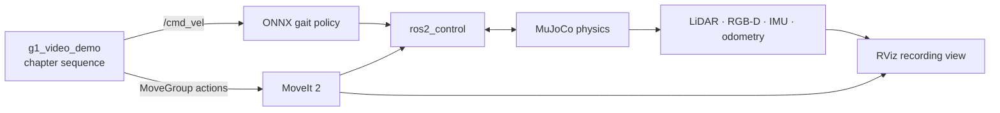

# First video: walking, sensing, and MoveIt

This is the recording guide for the repository's first integrated humanoid demonstration. One
launch shows several systems working together, while the on-screen chapter and telemetry labels
make the result understandable without scrolling through terminal logs.

## What the video proves

MuJoCo is the physics engine. The ONNX locomotion policy receives `/cmd_vel` and balances the G1
while walking and turning. MoveIt plans and executes the arm and Dex3 trajectories. RViz does not
simulate physics; it visualizes the live robot state, transforms, plans, path, and sensor streams
from the same ROS graph.



The chapters are:

1. live LiDAR, depth, and IMU check;
2. learned forward gait;
3. balanced turn;
4. curved walking command;
5. stop and stabilize;
6. MoveIt ready pose;
7. forward reach;
8. Dex3 power grasp;
9. hand release;
10. carry pose;
11. walking with the arms held in the carry pose;
12. final balance turn;
13. safe arm tuck and closing frame.

## Build once

From the repository root:

```bash
source scripts/native-env.sh
colcon build --symlink-install --packages-select g1_demos
source install/setup.bash
```

If optional MoveIt packages were not installed earlier, install them first:

```bash
sudo apt install ros-jazzy-pick-ik ros-jazzy-moveit-ros-perception
```

## Record

Use a 1920 x 1080 desktop and record RViz at 30 or 60 FPS. Close applications that display
personal information and keep the launch terminal outside the capture crop.

The launcher automatically selects an NVIDIA discrete GPU through PRIME offload when one is
available and prints the selected graphics mode. The recording view keeps the live LiDAR and RGB
camera enabled, while the much heavier RGB-D point cloud, duplicate MoveIt octomap geometry, and
trajectory mesh trail are disabled by default. Collision checking and trajectory animation remain
active. The MuJoCo viewer is capped at 30 FPS so it cannot monopolise a high-refresh GPU; physics
and controller rates are not capped. To use the desktop's current renderer instead, launch with
`G1_DEMO_GPU=desktop`. Override the viewer cap only when needed, for example with
`GROVE_G1_VIEWER_FPS=60`.

Terminal A:

```bash
cd ~/humainoid_ws/g1-ros2-jazzy
./scripts/first-video-demo.sh
```

The launch opens both MuJoCo and RViz and may need roughly 30–60 seconds on the first run. It
automatically waits for MuJoCo,
MoveIt, the controllers, LiDAR, IMU, odometry, and all 43 joint states. Do not start the take while
the label says `CHECKING MUJOCO + ROS 2 JAZZY`.

When the floating label changes to `READY TO RECORD`, frame the RViz camera, begin recording, then
press Enter in Terminal A. The wrapper calls the start service from inside the isolated simulation
network namespace.

The call is one-shot. If you need another take, stop and relaunch the stack so the robot starts at
the same pose and the walking trail begins empty.

To keep the MuJoCo viewer hidden and record only RViz, install `Xvfb` and use headless mode:

```bash
sudo apt install xvfb
./scripts/first-video-demo.sh headless:=true
```

For a slower machine, keep MuJoCo headless and reduce the gait speed, not the ROS clock:

```bash
./scripts/first-video-demo.sh headless:=true speed_scale:=0.8
```

After the take, press `Ctrl+C` in Terminal A and clean any process left by an interrupted GUI:

```bash
./scripts/clean-stack.sh
```

## Suggested narration

> This is my native ROS 2 Jazzy learning stack for the Unitree G1. MuJoCo is running the physics,
> while a learned ONNX locomotion policy balances the unpinned humanoid from velocity commands.
> The live point clouds come from simulated LiDAR and RGB-D sensors, and the overlay reports IMU
> uprightness and traveled distance. After walking and turning, the robot stops so MoveIt can plan
> collision-aware arm trajectories and command the Dex3 hands. It then holds a carry posture while
> the locomotion policy walks again. This separation of responsibility—learned whole-body gait,
> trajectory-planned manipulation, ros2_control ownership, and ROS sensor interfaces—is the part I
> wanted to study and make visible in this project.

## Editing notes

- Open with the `READY TO RECORD` frame for about one second, then trigger the sequence.
- Keep the floating chapter label and cyan walking trail in the crop.
- During arm stages, leave the MoveIt panel visible so the planning context is obvious.
- Use short captions: `Learned locomotion`, `Live LiDAR + RGB-D`, `IMU balance`, `MoveIt 2`, and
  `Dex3 hands`.
- Do not claim MoveIt plans the footsteps. The gait policy owns the legs; MoveIt owns arms/hands.
- End on the `DEMO COMPLETE` frame, then show the public repository URL.

## Troubleshooting

| Symptom | Fix |
|---|---|
| Demo remains on checking | Inspect `ros2 control list_controllers` and confirm LiDAR with `ros2 topic hz /livox/lidar`. |
| Start service says not ready | Wait for arm activation and the `READY TO RECORD` label. |
| No point cloud | In RViz, confirm the LiDAR display uses Best Effort reliability. |
| RViz is slow | Disable `RGB-D cloud` first; keep LiDAR, robot, path, and chapter overlay. |
| Motion stops | Read the floating label and Terminal A. The demo sends zero velocity after any uprightness or planning failure. |
| `Xvfb` is missing | Install the declared headless runtime dependency with `sudo apt install xvfb`, or launch with `headless:=false`. |
| Need another take | Stop the launch, run `./scripts/clean-stack.sh`, and relaunch. |

`first-video-demo.sh` creates a Linux network namespace with only the loopback interface before it
starts ROS. That OS-level boundary prevents the simulation process tree from reaching a physical
robot even if a DDS setting is changed later.
