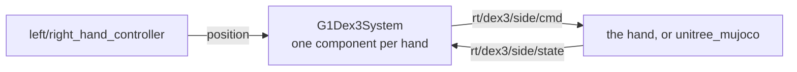

# g1_hand_interface

`ros2_control` `SystemInterface` for one Unitree Dex3-1 hand, over the hand's own `unitree_sdk2`
channels.

`ament_cmake`, C++20. Real hardware code: it speaks Unitree's published Dex3 contract and runs
unchanged on the robot, and the simulator answers the same channels.



Separate from `g1_hardware_interface` on purpose. The hand is a different device on different
channels with its own control authority, and one component per hand keeps a hand fault from taking
the arms down with it.

The component reaches the wire through the SDK's own CycloneDDS rather than through ROS. That is
why `CMakeLists.txt` pins `DT_RPATH` at the SDK's `lib/`: ROS ships a newer CycloneDDS under the
same SONAME, and binding both in one process corrupts the heap. `domain_id` and
`network_interface` must match `g1_hardware_interface`'s, because `ChannelFactory` is per process
and only its first `Init` takes effect.

## Interfaces

| Interface | Kind | Source |
|---|---|---|
| `position` | command | ramped, then clamped to the URDF limits |
| `position`, `velocity`, `effort` | state | `motor_state[i].q` / `.dq` / `.tau_est` |

| Channel | Direction | Type |
|---|---|---|
| `rt/dex3/<side>/cmd` | out | `unitree_hg::msg::dds_::HandCmd_` |
| `rt/dex3/<side>/state` | in | `unitree_hg::msg::dds_::HandState_` (`state_topic`) |

These are SDK channels, not ROS topics, so they carry the SDK's own QoS and do not appear in
`ros2 topic list`. `<side>` comes from the `side` parameter and must be `left` or `right`.

## Parameters

Values in `g1_description/config/dex3_params.yaml`.

| Parameter | Default | Meaning |
|---|---|---|
| `side` | required | `left` or `right`. Picks the channels and the joint prefix. |
| `domain_id` | required | SDK DDS domain. Must match `g1_hardware_interface`'s. |
| `network_interface` | `""` | Must stay empty: a non-empty value makes the SDK discard `CYCLONEDDS_URI`. |
| `kp` | 1.5 | Finger motors, not arm motors, so roughly 300x smaller than the arm's gains. |
| `kd` | 0.2 | |
| `command_publish_rate` | 100.0 | Hz. What Unitree's own teleop uses. |
| `max_joint_velocity_rad_s` | 3.0 | Slew clamp on the commanded position. |
| `state_timeout_ms` | 200.0 | State older than this blocks activation, and errors the component if it goes stale once active. |
| `state_topic` | `rt/dex3/<side>/state` | Which state channel to read. The YAML sets it as a prefix and suffix that the xacro joins around the side. |

The robot carries two state channels, `rt/dex3/<side>/state` and a lower-rate
`rt/lf/dex3/<side>/state`, and Unitree's own code disagrees about which to read: their Dex3 example
takes the `lf` one, their SDK bridge publishes the plain one. This is a control loop with a
freshness gate, so the full-rate channel is the default. It stays a parameter so hardware bring-up
can switch without a rebuild.

## What the wire format punishes

`motor_cmd` is an unbounded sequence, not a fixed array. Write it unresized and DDS accepts the
message while nothing moves. `on_init` resizes the preallocated frame once, so the write path never
allocates.

Joint order is positional, and it is the URDF's own: thumb_0, thumb_1, thumb_2, middle_0, middle_1,
index_0, index_1, identical for both hands. `on_init` refuses to start if the declared joints
disagree, because the failure is otherwise a hand that closes the wrong fingers. Unitree's own
`Dex3_1_Right_JointIndex` enum lists index before middle and contradicts their documented order. It
is inert in their code, but must not be copied here.

There is no blend weight. The first write takes full authority immediately, which is why the
component seeds its command from the measured position on activate and slews toward the target.

Timeout protection is armed only on release. While driving, the controller is the heartbeat, and
arming it would stop the fingers a second after any hiccup in the control loop.

Limits come from the URDF, which matches Unitree's published spec. Their SDK example disagrees on
`thumb_1` (0.724 against 0.611 rad) and its right hand says 0.742, which looks like a transposed
digit, so the conservative pair wins.

## In simulation

`unitree_mujoco` answers the same two channels, so this component is not swapped out for sim. The
responder is `dex3_handler.cc`, registered by vendor patch 004; the finger joints come from patch
003. It runs the same PD the hardware runs, from the `kp` and `kd` in the command, and clamps to
the URDF's effort limits.

- The fingers are driven through `qfrc_applied`, not through MuJoCo actuators. The vendored SDK
  bridge sizes itself from the actuator count and indexes a fixed 35-slot `LowCmd`, so 29 body
  motors plus 14 fingers would run it off the end of that array.
- `status = Lock` holds the finger where it is rather than going limp, matching what the
  hardware's status byte means. The same applies before any command arrives, and one second after
  the last one.

Finger contact is not simulated. The geometry is visual only, and grasping is modelled by
attaching the object in MoveIt's planning scene.

## Tests

```bash
colcon test --packages-select g1_hand_interface
```

`test_wire_contract` pins the mode byte's bit layout, the per-motor index, the joint order, and the
release and driven frames. It also loads the plugin through pluginlib, because a clean compile says
nothing about whether `controller_manager` can find the class through its XML export. No simulator
needed.

## Not yet verified on hardware

The real state publish rate, the press-sensor index-to-pad map, and the `thumb_1` upper limit. None
are documented publicly; each was measured against the simulator.
