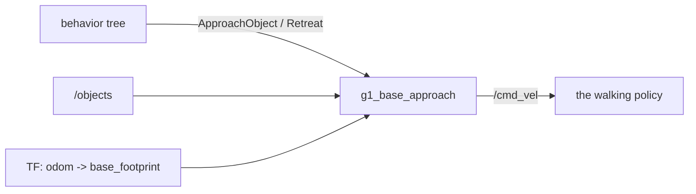

# g1_locomotion

The step between navigation and manipulation. Nav2 parks the robot within 0.5 m of a pose it chose
from a map, and the arm's usable window is about 0.2 m wide, so something has to close the gap.

`ament_cmake`, C++20. One node, `g1_base_approach`.



It writes `/cmd_vel` directly, the same topic Nav2 writes. Nothing arbitrates between the two
because the mission tree runs `NavigateToPose` and `ApproachObject` in sequence, never together.

It lives here rather than in `g1_manipulation` because everything that writes a velocity command
belongs to the package that owns the velocity path. The cost is a dependency on `vision_msgs`,
declared in `package.xml`.

## Interfaces

| Interface | Direction | Type |
|---|---|---|
| `~/approach_object` | action | `g1_msgs/action/ApproachObject` |
| `~/retreat` | action | `g1_msgs/action/Retreat` |
| `/objects` | in | `vision_msgs/msg/Detection3DArray`, sensor QoS |
| `/cmd_vel` | out | `geometry_msgs/msg/Twist` (`cmd_vel_topic`) |

`ApproachObject` closes the last gap to an object on `/objects` until it sits where the arm can
reach it. `Retreat` reverses the base clear of the surface and stops, without turning, because a
navigation goal normally follows and Nav2 does that properly.

## How it moves

One closed loop over all three axes at once. The walking policy takes a velocity and returns a
proportional fraction of it, so there is nothing to sequence: forward, lateral and yaw are driven
from the same tick, at `cmd_rate_hz` (20 Hz), against a freshly transformed object pose.

The property that shapes the control law is a deadband on both linear axes:

| commanded | delivered v_x | delivered v_y |
|---|---|---|
| 0.10 | 0.016 | 0.007 |
| 0.20 | 0.123 | 0.083 |
| 0.30 | 0.208 | 0.201 |
| 0.40 | 0.329 | 0.301 |

So the law is proportional with a floor, not plain proportional. A pure P term a couple of
centimetres outside the window asks for 0.02 m/s, which the robot ignores completely, and the
approach stalls there until its timeout. `min_speed_x_mps` (0.20) and `min_speed_y_mps` (0.25) are
that floor, lateral sitting higher because the gait tracks it worse. Inside the tolerance the
command is exactly zero, which is what ends the loop rather than a separate test.

Yaw has no deadband and tracks near 1:1 in both directions, so it gets no floor. A small heading
correction lands as asked, and flooring it would swing the robot past square.

Reverse is symmetric enough to use the same numbers, delivering -0.140 m/s at a commanded -0.20,
which is why being too close to an object is recoverable rather than terminal. Only an object under
the robot's own footprint (`min_forward_m`) ends the goal, and the tree re-stages through Nav2.

On arriving, the node stops, holds zero for `settle_s` while the gait finishes the stride it is in,
then re-reads and re-judges. A coast that carries the object back out of the window is driven out
again rather than reported as success.

## What it aims at

The window is judged in the base frame, because that is the frame the arm works in. Where the
object sits relative to the robot is the whole of reachability, and which way the room faces is not
part of it. Heading is held while closing, from the working yaw the navigation goal used, but it is
not part of arriving: it is zeroed the moment both linear axes are inside tolerance.

`target_x_m` (0.270) and `target_y_m` (-0.220) come from the arm's reachable band, measured with
`/compute_ik` and `/check_state_validity` at the workbench. `forward_tolerance_m` (0.050) is
deliberately tighter than that band: the arm grants about 0.11 m, and the measured coast after the
loop stops commanding is 0.025 to 0.037 m, so holding 0.05 leaves the object 0.013 to 0.025 m from
target instead of anywhere in an 0.11 m window. The coast always shrinks the error rather than
growing it, because it carries on in the direction the loop was driving.

`standoff_object_ids` and `standoff_target_x_m` name objects that need a different `target_x_m`
from the default. Reaching over a surface to set something down sweeps the palm and wrist across
its face, which reaching onto one for an object does not, so `drop_pad` is approached to 0.350
where the cube uses 0.270.

A missing object pose or base transform stops the robot and is re-read for `lookup_grace_s` (3.0 s)
before the goal fails. Both go briefly unavailable for reasons that are not this skill's problem,
such as a TF buffer that has not caught up after the base moved, and failing on the first miss
throws away a healthy approach with `/objects` publishing throughout.

## Configuration

`config/g1_base_approach.yaml`, where every number carries the measurement behind it. The speed
floors and ceilings are properties of the walking policy and would be re-measured for a different
one. The reach window is a property of the arm and carries to hardware unchanged.

## Tests

```bash
colcon test --packages-select g1_locomotion
```

`test_approach_planner` covers the control law without a simulator: the deadband floor that makes
it converge, the caps, that both axes drive at once, sign correctness, heading held but not
required, the recoverable overshoot and the terminal one, and the limits it refuses.
