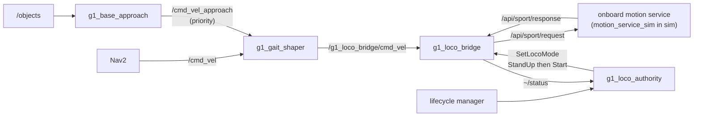

# g1_locomotion

The G1's LocoClient bridge, plus the nodes that make a planner's velocity output usable by the real
gait. The bridge carries to hardware unchanged; the shaper and the base approach exist because of
the SIM walking policy's dead zone and are not launched on the robot.

`ament_cmake`, C++20.



## Nodes

| Node | Kind | Purpose |
|---|---|---|
| `g1_loco_bridge` | lifecycle | Turns `Twist` and `SetLocoMode` goals into vendor JSON requests, correlates the async responses, and re-issues velocity so the robot keeps moving. |
| `g1_gait_shaper` | plain | Collapses a planner's continuous velocity onto the four motions this gait can actually produce, and arbitrates its two inputs. |
| `g1_loco_authority` | lifecycle | Acquires locomotion authority on activate and releases it on the way out. |
| `g1_base_approach` | plain | Walks the base into arm's reach of an object measured on `/objects`, and backs it out again. Two actions. |

## Interfaces

| Name | Direction | Type |
|---|---|---|
| `/g1_loco_bridge/cmd_vel` | in | `geometry_msgs/msg/Twist` |
| `/g1_loco_bridge/set_mode` | action | `g1_msgs/action/SetLocoMode` |
| `/g1_loco_bridge/status` | out | `g1_msgs/msg/LocoStatus`, reliable and transient-local |
| `/api/sport/request` | out | `unitree_api/msg/Request` |
| `/api/sport/response` | in | `unitree_api/msg/Response` |
| `/cmd_vel` | in | `geometry_msgs/msg/Twist`, the shaper's ordinary input (Nav2's) |
| `/cmd_vel_approach` | in | `geometry_msgs/msg/Twist`, the shaper's PRIORITY input |
| `/objects` | in | `vision_msgs/msg/Detection3DArray`, what the approach steers by |
| `/g1_base_approach/approach_object` | action | `g1_msgs/action/ApproachObject` |
| `/g1_base_approach/retreat` | action | `g1_msgs/action/Retreat` |

## Running

The bridge comes up with the rest of the stack:

```bash
ros2 launch g1_bringup bringup.launch.py
```

Reach `Start` before commanding any velocity. Outside `Start` the responder rejects velocity and
nothing reaches the legs:

```bash
ros2 action send_goal /g1_loco_bridge/set_mode g1_msgs/action/SetLocoMode "{fsm_id: 4}"    # StandUp
ros2 action send_goal /g1_loco_bridge/set_mode g1_msgs/action/SetLocoMode "{fsm_id: 500}"  # Start
ros2 topic pub /g1_loco_bridge/cmd_vel geometry_msgs/msg/Twist "{linear: {x: 0.6}}"
```

Under navigation, `g1_loco_authority` does the two transitions itself and the shaper feeds the
bridge, so none of the above is needed.

## The gait shaper

The simulated gait has a hard initiation dead zone with no hysteresis, so the usable action set has
five elements: stop, drive straight, reverse, strafe, turn in place. `GaitShaper` reduces a continuous
velocity onto exactly those.

Strafe was not always one of them. It was dropped because Nav2 cannot command lateral on this robot
anyway, and re-added for milestone 9: the mobile-manipulation answer to "park precisely enough for
the arm to reach" is a holonomic base, and this gait IS holonomic at the velocity level, with
lateral motion measured from 0.50 m/s. Throwing it away made every sideways correction cost a turn,
a step and a turn back.

It is subtractive only. Every output is the input unchanged, the input clamped smaller, or zero,
never larger. That invariant is swept as a property test rather than spot-checked, because turning
a small command into a large motion is what this stack's control-mode rules exist to prevent.

Yaw is tested first, so a command carrying both becomes a pure turn. Forward is compared signed, so
any negative `vx` becomes zero at any magnitude; reverse measures well inside the dead zone anyway,
and this is why a misconfigured recovery behaviour cannot produce a reverse lurch.

The dead zone belongs to the simulated walking policy, not the real G1's onboard controller, which
has no such gap. That is why the shaper lives here and not in Nav2 tuning: hardware bring-up simply
does not launch it.

`config/g1_gait_shaper.yaml`:

| Parameter | Default | Meaning |
|---|---|---|
| `fwd_engage` | `0.45` | Forward speeds below this become a stop. |
| `yaw_engage` | `1.20` | Yaw rates below this become a stop. |
| `yaw_clamp` | `1.57` | Ceiling on the turn that is passed through. |
| `rev_engage` | `0.55` | Reverse's OWN threshold, higher than forward's. |
| `lat_engage` | `0.50` | Lateral speeds below this become a stop. The policy's measured step point. |
| `lat_clamp` | `0.50` | Ceiling on the strafe, matching the bridge's own `max_velocity[1]`. |
| `override_timeout_s` | `0.5` | How long `cmd_vel_override` keeps priority after each message. |

Reverse has a separate, higher threshold rather than being refused outright. The policy measures
-0.247 m/s at a commanded -0.60 and exactly 0.000 at -0.40, so reverse exists but only well past
where a planner would ask for it: Nav2's backup speeds are 0.025 to 0.15 m/s and stay zeroed, which
is the backstop the old blanket refusal provided. What it buys is that `g1_base_approach` can back
away from a workbench without turning into it. An infinite reverse is refused explicitly, since
unlike `+inf` against a lower bound it does satisfy its own comparison.

The primitives are mutually exclusive and tested in order: yaw, then forward, then reverse, then
lateral. A
command carrying more than one collapses to the first that engages, because the measured response
to mixed commands is bad -- a commanded `(0.50, 0, 0.50)` came out `(0.337, 0.299, 0.390)`.

The constructor rejects a configuration it cannot honour, including `yaw_clamp` below `yaw_engage`
or `lat_clamp` below `lat_engage`, either of which would accept a command and then clamp it back
under the threshold that accepted it.

### It also decides who may write velocity

Since milestone 9 there are two writers: Nav2 on `cmd_vel_in`, and `g1_base_approach` on
`cmd_vel_override`. While the override has published within `override_timeout_s` its commands win
and Nav2's are DISCARDED, not queued -- a navigation command replayed seconds later would drive the
robot somewhere it was told to go long ago.

Priority is time-based rather than latched on purpose: a skill that dies mid-approach must not keep
the channel, and every path that would have to release a latch is a path where something has
already gone wrong.

`twist_mux` is the off-the-shelf answer and does not work in this container: `ros-humble-twist-mux`
4.3.0 links `libdiagnostic_updater.so`, and the only `ros-humble-diagnostic-updater` this apt
snapshot carries is Python-only and ships no such library, so the binary dies at load with exit 127.
There is no second version to pin. The shaper was already the sole writer onto the bridge's input,
so making it the sole arbiter of its own inputs adds no authority to the system.

## The base approach

`g1_base_approach` is the step between navigation and manipulation. Nav2 parks the robot within
0.5 m of a pose it chose from a map; the arm's usable window is about 0.2 m wide. Nothing bridged
that, which is why navigate-then-pick did not work at all before this node existed.

It serves two actions:

| Action | What it does |
|---|---|
| `ApproachObject` | Closes the last gap to an object on `/objects`, until it sits where the arm can reach it. |
| `Retreat` | Reverses the base clear of the surface and stops. No turn, no walk -- a navigation goal follows and Nav2 does that properly. |

### Why it is here and not in g1_manipulation

Everything that writes a velocity command belongs to the package that owns the velocity path. A
manipulation package publishing into locomotion's channel is the shape of bug the stack's
control-mode rules exist to prevent, even when the topic itself is harmless. The cost is that
this package now depends on `vision_msgs`, which is documented in `package.xml`.

### How it moves

Continuous velocity, closed on the measured error, with a lead because the gait coasts. NOT pulses:
repeated command-and-stop cycles wind the walking policy down, from 8.3 degrees of turn on the
first pulse to 0.1 by the twentieth.

**There is no turning in the approach, and the planner cannot ask for one.** The heading comes
from the navigation goal and the arm does not care which way the room faces, so the error is
nulled with forward, reverse and strafe. Yaw survives only as an aim before a forward drive,
because a forward step yaws +8 degrees and an uncorrected sequence walks an arc.

The heading correction is a hybrid: a continuous turn cannot stop inside the tolerance, since the
gait coasts about 17 degrees after the command ends, so it drives while the error exceeds that and
takes one short pulse below it. Every stopping lead must stay under its axis tolerance, or the
planner asks for a move the drive reports as already arrived and the loop spins.

Fine forward motion, which the gait cannot produce directly, is a forward drive that stops at zero
and a reverse that takes back whatever the coast added. Reverse resolves more finely than forward:
-0.247 m/s against 0.35.

Two earlier designs turned and both failed on it.

### What it aims at

The window is judged in the BASE frame, because that is the frame the arm works in. Where the object
sits relative to the robot is the whole of reachability; which way the room faces is not part of it.
An earlier version judged it in the working-heading frame and spent most of its pulse budget chasing
alignment that cost nothing.

`standoff_object_ids` / `standoff_target_x_m` name objects that need a different `target_x_m` from
the default. Reaching over a surface to set something down sweeps the palm and wrist across its
face, which reaching onto one for an object does not: `drop_pad` is approached to 0.350 where the
cube uses 0.270.

`target_x_m` / `target_y_m` and their tolerances are the arm's reachable band, MEASURED with
`/compute_ik` plus `/check_state_validity` at the workbench, not guessed. Being stricter than the arm is not free: a run that finished a good approach 13 mm
outside a too-tight forward tolerance then creeped for forty pulses.

A missing object pose or base transform is re-read for `lookup_grace_s` (3.0) before the goal
fails. Both go briefly unavailable for reasons that are not this skill's problem -- a TF buffer that
has not caught up after the base moved, a sample arriving late -- and failing on the first miss
threw away a healthy approach mid-mission with `/objects` publishing at 10 Hz throughout.

The skill's weak spot is where Nav2 parks it. Good arrivals converge in 3 to 10 pulses; one arrival
24.6 degrees off heading with 0.47 m of lateral error never converged, because the aim only runs
before a forward drive and only to 20 degrees.

`config/g1_base_approach.yaml` is heavily commented and every number in it has a measurement behind
it. **None of them transfer to hardware**: they encode this sim policy's dead zone, its asymmetric
yaw, and how far it coasts. The real G1's onboard controller has none of that, so on hardware this
node is not launched -- the same standing as the gait shaper.

## The authority bracket

A planner publishes velocity and nothing else. It has no way to send the `SetLocoMode` goals the
bridge needs first, so `g1_loco_authority` is that missing step, expressed as a lifecycle
transition: active means the robot is walk-capable, inactive means authority has been handed back.

It releases on deactivate, shutdown, error, a failed activate, and on a process signal. Without it
the bridge silently discards `cmd_vel`, Nav2 sends no goal, and the whole stack looks healthy while
the robot never moves.

It deliberately does not auto-acquire on the first `cmd_vel`. That is implicit acquisition, and a
stray publisher would stand the robot up and walk it.

| Parameter | Default | Meaning |
|---|---|---|
| `acquire_timeout_s` | `5.0` | Matches the bridge's own request timeout. |
| `settle_after_start_s` | `2.5` | The gait is not responsive the instant `Start` returns. |
| `set_mode_action` | `/g1_loco_bridge/set_mode` | A parameter, not a remap. Remapping does not reach the action client on Humble. |

## Configuration

`config/g1_loco_bridge.yaml` carries the velocity re-issue period, the request timeout, the axis
signs and the per-axis maxima. The axis signs and maxima are simulator properties, in the same way
the shaper's thresholds are.

## Tests

| Test | Needs a simulator | Covers |
|---|---|---|
| `test_loco_payloads` | no | Exact JSON wire payloads and the parser. |
| `test_loco_correlator` | no | Overlapping and out-of-order requests, sweep timeouts, the orphaned-response race, the pending bound. |
| `test_velocity_gate` | no | Re-issue cadence, stale and zero-command idling, the failure-streak release, the authority state machine. |
| `test_gait_shaper` | no | The dead zone, primitive exclusivity, the signed-forward asymmetry, the never-amplifies invariant, config validation. |
| `test_loco_bridge_node` | no | The node itself against a fake responder on an isolated domain. |
| `test_authority_release` | no | An acquire that fails after the bridge already believes authority is held. |
| `test_approach_planner` | no | The approach's decisions: when to step, when to creep, the creep's direction, the overshoot that is recoverable and the one that is not, and the limits it refuses. |

```bash
colcon test --packages-select g1_locomotion
```

Nothing here needs a simulator. `g1_bringup`'s `test_loco` validates the wiring between this bridge
and a real responder over DDS.
