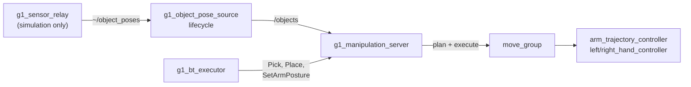

# g1_manipulation

Pick and place, served as actions over MoveIt, plus the node that decides where object poses are
allowed to come from.

`ament_cmake`, C++20. Two nodes.



The server adds no command path. It is another client of `move_group`, which is another client
of the controllers that already own the arm joints and the hand channels, so every low-level
channel keeps exactly one writer.

It also takes no control authority. The arm and hands must already be acquired before a goal
will execute, and releasing them is the caller's job. For a mission that is `g1_orchestration`'s
executor, which brackets the whole run: a skill that acquired per goal would hand the hands back
between pick and place and drop what it was carrying.

## Where object poses come from

`g1_object_pose_source` is the boundary between manipulation and perception. Skills consume
`/objects` and never learn which source filled it, so a real detector replaces this node without
touching them.

| `object_source` | Behaviour |
|---|---|
| `sim_ground_truth` | MuJoCo body poses, sampled inside the simulator and carried out by `g1_sensor_relay`. |
| `hardware` (default) | **Refuses to configure.** There is no object-detection pipeline on this robot yet. |

`hardware` is the default deliberately, matching `g1_state_estimation`'s odometry source: a
bring-up that forgets to say what it has must fail visibly rather than feed a grasp planner
simulator ground truth it cannot tell from a measurement.

These poses are exact: no noise, no occlusion, no misdetection, and every listed object always
visible. Nothing here validates behaviour under a detector that is wrong.

`/objects` is `vision_msgs/Detection3DArray` in `odom`, carrying a pose and a bounding box per
object. The box is what the server builds its collision geometry from, so replacing the source
with a real detector changes nothing downstream.

## Actions

| Action | Goal | Notes |
|---|---|---|
| `~/pick` | `object_id`, `arm` | No pose in the goal: it is read from `/objects` when the goal starts, so a retry re-reads rather than replaying. |
| `~/place` | `surface_object_id` **or** `pose`, `arm` | Prefer the surface: it is read from `/objects` and the object is stood on top of it. A `pose` is where the **object** ends up, not the hand, transformed into the planning frame on arrival. |
| `~/set_arm_posture` | `group`, `named_target` | Named SRDF poses only. |

`Pick` and `Place` publish a phase as feedback and name that phase in the result on failure.
Every `Pick` failure path leaves the hand open and nothing attached, so a retry starts from a
defined state rather than part-way into a grasp, which is what makes the behavior tree's retry
meaningful rather than a replay.

## Where the hand grips

Not a number in this package. `{side}_hand_grasp_frame` is a link in `g1_description`, and pose
goals are given for that frame, so nothing here does offset arithmetic.

The palm link's origin is not the point the fingers close on: at the SRDF's `closed` posture the
Dex3's fingers curl toward the palm's **+y**, and the grip lands about 1 cm forward of the origin
and 4.4 cm to the side. Planning to the palm puts the object through the fingers. Because it is a
frame, checking it is a matter of looking at it in RViz:

```bash
ros2 run tf2_ros tf2_echo right_hand_palm_link right_hand_grasp_frame
```

That the fingers close toward +y is also why `grasp_rpy` is a **roll**: it is the roll that turns
the closing axis toward the floor for a grasp off a table, and pitching the palm instead produces
poses with no IK anywhere useful.

### Vertically it grips near the top face, not the centre

Horizontally the grasp frame goes straight to the object. Vertically it does not, and aiming at the
centre was wrong. With the closing axis pointing at the floor the fingertips sit about 24 mm beyond
the grasp frame along it, so targeting the middle of a 60 mm cube puts them 6 mm above the table,
inside the octomap's own 20 mm self-filter padding. The hand was being asked to close *through* the
surface, and the descent failed every time with `GOAL_STATE_INVALID`.

`grasp_height_above_top_m` (0.010) is measured up from the object's top face, using the height the
pose source reports in its bounding box. Held above the face, the palm clears the object and the
fingers close around its upper half. `Place` mirrors it, reading the held object's height back out
of the attached collision object, so an object is released at the same relative height it was
grasped at.

## Grasping is contact

The planner cannot tell intended contact from a collision, and two things are unavoidably in the
way of a grasp: the octomap, which holds the support surface and the object, and the object's own
collision geometry, added so plans route around it right up until the hand is meant to close on
it. Both are handled, and how they are handled matters:

- The object is **removed** before the final descent and re-added as an **attached body** after
  the hand closes. Attached bodies are filtered out of the octomap by
  `PointCloudOctomapUpdater`'s shape mask; plain world objects are not.
- The hand and its wrist are exempted from octomap collision **only for the final approach**, not
  for the whole skill. Exempting the transit lets a plan route the arm straight through the
  table, which is visible in the viewer.

The exemption is restored on every exit path, including failure.

### The pregrasp has to clear the octomap on its own

The exemption covers the descent and nothing before it, so the PREGRASP is planned fully
collision-checked and must be genuinely clear. Measured at the facility workbench by asking
`/check_state_validity` for the colliding link pair rather than inferring it:

| grasp-frame height, pelvis frame | verdict |
|---|---|
| +0.10 | palm, all three thumb links, both wrist links |
| +0.1575 | `<octomap> <-> right_hand_thumb_2_link` |
| +0.22 and above | clear |

The cube sits at pelvis z +0.0375, so `approach_height_m` has to exceed 0.185. It is 0.22.
`lift_height_m` is 0.20 for a sharper reason: the exemption is restored at the end of the lift, so
wherever the lift finishes becomes the START state of the next collision-checked plan, and finishing
inside the octomap leaves the carry posture unplannable.

Judging the reachable window by "solves at both heights" is a mistake worth naming: the grasp pose
sits on the table and is inside its octomap *by construction*. Only the pregrasp has to be
collision-free.

The exemption covers the hand group, the palm and **all three** wrist joints. Roll was missing for
a while and it is the one that reaches: a place aborted with the start state in collision,
`<octomap> <-> right_wrist_roll_link`, on a plan whose every other link was exempt. It presents
misleadingly, because the start-state fixer finds a valid nearby state and the plan comes back
successful before the final validity check throws it out. "Motion plan was found but it seems to be
invalid" is what an incomplete ACM looks like. The set matches the `touch_links` the pick
attaches with, and should stay matched.

### Place a surface, not a coordinate

`Place` takes a `surface_object_id` and resolves the drop point from `/objects`, adding half the
surface's height and half the held object's so it lands resting rather than intersecting.

The coordinate path still exists but is a trap for anything the base approached. A tree writes its
target in the **map** frame; `ApproachObject` parks the base against `/objects`, which is published
in **odom**. Those agree only as well as AMCL does, and it was measured 0.23 m out at the storage
bench, against an arm window 0.04 m wide, so a target correct on the map sat 0.14 m outside
anything the arm could reach and failed every attempt with `GOAL_STATE_INVALID`. Reading the surface
from the stream the approach used makes the two agree by construction.

### Named postures plan and execute; they do not call move()

`MoveGroupInterface::move()` runs through MoveIt's `PlanExecution`, which re-checks the remaining
path against every planning-scene update and aborts on the first that invalidates it. With a chest
camera continuously re-integrating voxels around the arm that is moving, something invalidates it
constantly: the carry failed three times on three different links, each about two thirds of the way
through an already-valid plan. Everything here now plans and executes as `Pick` always did.
Both are fully collision-checked at plan time; only the in-flight recheck is gone, and on this
stack it was reporting the robot's own arm.

## Running

Comes up with the operator entry point:

```bash
ros2 launch g1_bringup bringup.launch.py moveit:=true manipulation:=true pin_pelvis:=true world:=manipulation activate_arm:=true activate_arm_delay_s:=40.0
```

`manipulation:=true` requires `moveit:=true`, and turns on `sensors:=true` itself, because object
ground truth leaves the simulator over the sensor relay's socket. Without it the pose source comes
up healthy and never receives anything.

```bash
ros2 action send_goal /g1_manipulation_server/pick g1_msgs/action/Pick \
  "{object_id: red_cube, arm: right}" --feedback
```

`activate_arm_delay_s` is raised from its default because this world takes longer to come up than
the delay assumes, and the acquire otherwise fires before `/lowstate` flows.

## Configuration

| File | Contents |
|---|---|
| `config/g1_object_pose_source.yaml` | The source, and the frames it verifies. Simulation only as shipped. |
| `config/g1_manipulation_server.yaml` | Approach and lift clearances, speed, planning time, and how the hand is held at the grasp. |

`grasp_rpy` is the only geometric tunable here. The *where* is the grasp frame in the URDF,
because it is a property of the Dex3 rather than of a task.

## Tests

| Test | Needs a simulator | Covers |
|---|---|---|
| `test_object_pose_source_node` | no | Source selection, the **hardware refusal**, the default being the refusing one, frame verification, stamp passthrough, and staying quiet until activated. |
| `test_grasp_geometry` | no | Arm-to-group-and-frame resolution and its refusals; that the grasp goal passes position through untouched and points the closing axis at the floor; that the two hands mirror. |

```bash
colcon test --packages-select g1_manipulation
```

`test/test_pick_place.launch.py` is a full sim mission and is deliberately **not** registered,
because it does not currently pass. The failure is real rather than a test defect: the robot is
staged at the workbench with its arms hanging, a hanging hand sits about 1 cm under the bench slab
and so inside its octomap, and `CheckStartStateCollision` looks at the whole robot rather than the
group being planned for, so every plan is refused. Fixing it is a rest-pose question for the
control stack. Run it by hand meanwhile:

```bash
python3 -m launch_testing.launch_test src/g1_manipulation/test/test_pick_place.launch.py
```

### Object poses and frames

The source subscribes to poses in the frame the detector measured from and transforms them into
`output_frame_id` through TF. In simulation `g1_sensor_relay` reports in
`camera_color_optical_frame`, which is what a real 6D-pose detector on the D435 produces, so the
same path runs on the robot.

It transforms rather than relabelling. Announcing an object directly in a fixed frame is correct
only while that frame IS the world, which stops being true the moment odometry is an estimate:
with `odometry:=fast_lio` the base approach chased a point 2 m from the cube until this was fixed.

`publish_markers` (default true) adds `~/object_markers`, a box and a label per object built from
the same message `/objects` carries, so rviz shows what a skill acts on. Both shipped rviz
configs display it.

| Parameter | Default | |
|---|---|---|
| `source_frame_id` | `camera_color_optical_frame` | The frame the detector measures in. |
| `output_frame_id` | `odom` | Fixed, so MoveIt collision objects do not move with the robot. |
| `publish_markers` | `true` | `~/object_markers` for rviz. |
