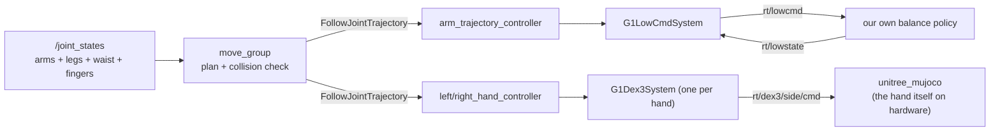

# g1_moveit_config

MoveIt 2 planning for the G1's two 7-DoF arms, layered on the `arm_trajectory_controller` the
control stack already runs.

`ament_cmake`, configuration and launch only. No nodes: `move_group` is upstream.



MoveIt adds no command path. It is another client of actions the controllers already serve, so
the arm channel and each hand's topic keep exactly one writer.

## Arm ownership

The hardware component leaves any unclaimed joint unpowered, so the arms are always held by
something. `arm_freeze_controller` has them until the arm is acquired, and the acquire trades
the two in a single switch, never both out at once, or the arms drop.
`g1_controllers`' README has the full ownership table.

`move_group.launch.py` loads the same description `robot_state_publisher` does, so planning and
execution always agree about the model. `test_moveit_config_drift` reads the controller config
against the description and fails if they diverge.

The hands are separate components on their own SDK channels (`rt/dex3/<side>/{cmd,state}`), so
`activate_arm` brings them up after the arm and treats them as best-effort: a hand that is
absent or not reporting state leaves the arm usable. `G1Dex3System` refuses to activate without
fresh feedback, so that shows up as an inactive component rather than as fingers driven from a
stale measurement.

## Planning groups

| Group | Joints | Chain |
|---|---|---|
| `left_arm` | 7 | `torso_link` to `left_hand_palm_link` |
| `right_arm` | 7 | `torso_link` to `right_hand_palm_link` |
| `both_arms` | 14 | the two above, composed |
| `left_hand` | 7 | the Dex3 fingers, a tree rather than a chain |
| `right_hand` | 7 | as above |

`both_arms` is what makes two-handed motion a single plan: it is the only group that
collision-checks one arm against the other, and the only one that times a motion so both hands
arrive together. The per-arm groups remain because a 7-DoF search is far cheaper.

The hands are separate groups, never joints on an arm group, because they are a separate device
reached over separate topics with separate control authority. `test_robot_model`
pins that: no arm group may contain a finger joint. Each is listed as its arm's `end_effector`,
which is what lets `attachObject` work out its own touch links.

Groups are rooted at `torso_link`, not `pelvis`. The three waist joints are held by
`waist_freeze_controller` for the whole session, so a group spanning them would plan motion nothing
will execute. Their *state* still matters, since it places the torso under the pelvis, and
`joint_state_broadcaster` publishes it from the component along with everything else.

The planning frame is `pelvis`, because the vendored URDF's floating base is commented out and
the SRDF declares no virtual joint. Fine while the robot stands still to manipulate; scene
objects fixed in `odom` would need a virtual joint instead.

## Named poses

Set from the MotionPlanning panel's goal-state dropdown, or with
`move_group.setNamedTarget("tucked")`. Each exists for `left_arm`, `right_arm` and `both_arms`.

| Pose | What it is |
|---|---|
| `home` | Where the simulator actually holds the arms: shoulders back, elbows bent. Measured, not chosen. |
| `zero` | Every arm joint at 0. Arms straight down at the sides. |
| `tucked` | Arms in close, elbows well bent. The posture to navigate in: smallest swept volume and least COM offset. |
| `ready` | Forearms up and forward, clear of the torso, without being extended. |
| `reach_front` | Reaching a surface in front. The pick-and-place working posture. |

Every value was collision-checked against a running `move_group` before being written into the
SRDF, and `test_robot_model` pins them: the three per-group copies must agree, and all must sit
inside the joint limits. Poses are a convenience, not a safety mechanism, and MoveIt still plans
and collision-checks the path to one.

The hands have two postures each, on `left_hand` and `right_hand`:

| Pose | What it is |
|---|---|
| `open` | Every finger joint at 0. Fingers straight, thumb mid-range. |
| `closed` | A power grasp, curled short of the end stops so the fingers can press into an object. |

That is the whole vocabulary a pick and place needs: reach open, close, `attachObject`, move,
place, open, `detachObject`. Contact physics is not simulated, so in sim the object is held by
the attachment rather than by friction. On hardware it is held by both.

`tucked` is worth knowing about beyond convenience. Arm pose measurably disturbs a walking
humanoid, and the standing recommendation is to manipulate stationary and navigate with the arms
in.

## Kinematics

`pick_ik` on each arm. Each arm is 7 joints against a 6-DoF pose, so the solver's choice within
the null space is the whole question, and KDL's pseudo-inverse wanders it and clamps at joint
limits. Swapping back is one line in `config/kinematics.yaml`.

`both_arms` deliberately has **no** solver entry. pick_ik, like KDL and TRAC-IK, rejects any
group that is not a chain; MoveIt instead routes a pose goal per hand through the per-arm
solvers, and it only builds that subgroup map for groups with no solver of their own. Adding an
entry for `both_arms` silently breaks its IK. A test asserts this.

For two simultaneous Cartesian goals, call `setPoseTarget(pose, link)` once per hand.
`setPoseTargets` means something else: alternative goals for one link.

## Speed

`config/joint_limits.yaml` caps every arm joint at 0.8 rad/s and every finger at 2.0, and adds the
acceleration limits the URDF does not declare.

The URDF's own 22 to 37 rad/s are motor limits, not what the arm tracks. `arm_trajectory_controller`
claims position alone, so the component runs those joints on its `position_only_kp` of 25 to 40,
soft enough that a trajectory timed against the motor is one the arm falls behind. That surfaces as
the controller aborting on a goal-time tolerance which looks unrelated to speed.

The fingers have a real clamp behind them: `G1Dex3System` slew-limits every finger at
`max_joint_velocity_rad_s` (3.0), and planning faster just stretches the motion until the goal-time
tolerance trips. `test_moveit_config_drift` asserts every finger limit here stays under it. The body
component has no equivalent clamp, deliberately, since it would throttle exactly the fast
corrections the balance policy needs.

## Running

One command, from the operator entry point:

```bash
ros2 launch g1_bringup bringup.launch.py moveit:=true pin_pelvis:=true rviz:=true
```

Or this package on its own, which is what the integration test launches:

```bash
ros2 launch g1_moveit_config moveit_sim.launch.py pin_pelvis:=true
ros2 launch g1_moveit_config moveit_rviz.launch.py
```

Either route turns on the non-arm joint states for you. `move_group` will not plan until every
joint it models has a state, and the arms hang off three waist joints `joint_state_broadcaster`
does not own.

With a navigation mode as well (`mode:=localization nav:=true moveit:=true rviz:=true`), the one
RViz that opens is this package's. Run a second `rviz2 -d` on `g1_navigation.rviz` for the map and
costmaps: a single combined window segfaults rviz2 once Nav2 is running.

Planning works immediately. Executing does not, until the arm is acquired: the component first,
then the controller.

```bash
ros2 launch g1_bringup activate_arm.launch.py
```

Until then the controller refuses the goal, which is the intended failure rather than a bug.
`moveit_manage_controllers` is false so MoveIt never activates anything itself. Release with
`deactivate_arm.launch.py` on success or failure alike.

Nothing currently stands the torso off-square, which is what would exercise the arm groups
composing through a turned waist. `waist_freeze_controller` latches whatever angle the scene
starts at, so giving the MJCF keyframe a non-zero waist is the way back to that coverage.

## Seeing the world

`config/sensors_3d.yaml` feeds `/livox/lidar` into an octomap, so plans route around real
obstacles rather than only the robot itself. It comes up with `sensors:=true`:

```bash
ros2 launch g1_moveit_config moveit_sim.launch.py sensors:=true pin_pelvis:=true world:=perception
```

The octomap is built in the planning frame, `pelvis`. `octomap_frame` exists but is never read,
because move_group constructs the monitor with the planning frame directly. That is fine
while the pelvis is pinned or the robot stands still; a walking pelvis drags the voxel grid with
it and the map smears. `/clear_octomap` (`std_srvs/Empty`) resets it; there is no time decay, so
a voxel the sensor cannot currently see is never forgotten.

It reads the LiDAR rather than the depth camera, and not by preference: the camera publishes a depth image,
and `depth_image_proc`'s converter cannot receive from our best-effort relay.

## The collision matrix

`config/g1.srdf` is hand-written except for its `disable_collisions` block, and the header inside
the file records how that block was generated and when.

`collisions_updater` does not finish on this model, at any trial count, because 38 of the URDF's 52
collision elements are full visual STL meshes totalling about 525k triangles. The shipped matrix
comes from the robot's own rest pose instead: link pairs joined by a joint, plus pairs found
touching by `/check_state_validity`. 54 pairs, deliberately conservative, disabling what genuinely
touches and nothing speculative.

It contains no cross-arm pair, which matters, because `both_arms` exists to collision-check one arm
against the other. `test_robot_model` asserts those stay enabled.

## Tests

| Test | Needs a simulator | Covers |
|---|---|---|
| `test_moveit_config_drift` | no | This package against `g1_controllers`' controller config and `g1_description`'s hand clamp; the composite-group solver rule; SRDF well-formedness. |
| `test_robot_model` | no | Group composition and order, planning frame, no hand or waist joints in an arm group, the collision matrix's adjacent pairs and its cross-arm pairs, and the named poses (per-group copies agree, all within joint limits). |
| `test_launch_threading` | no | The arguments `g1_bringup`'s `moveit:=true` branch threads into the simulator, the RViz choice, and that `moveit_sim.launch.py` still composes what it did. |
| `test_octomap_blocks_a_plan` | yes | That the octomap fills from the LiDAR **and** that MoveIt collision-checks against it: a reach into a mapped obstacle is rejected, with `<octomap>` named in the contact. |
| `test_moveit_lowcmd` | yes | The same path with the pelvis unpinned: every motor claimed before the acquire, the freeze traded for the trajectory controller and back, both arms moving without the balance policy losing the robot, and both hands activating and closing through MoveIt. |

```bash
colcon test --packages-select g1_moveit_config
```
