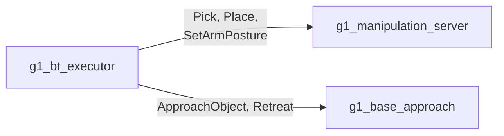

# g1_msgs

The stack's own interfaces: what `g1_locomotion` serves for the base approach, and what
`g1_manipulation` serves to the behavior tree. Five actions, no messages.

`ament_cmake` with `rosidl_default_generators`. No source of its own.



```bash
colcon build --symlink-install --packages-select g1_msgs
```

## Manipulation

Served by `g1_manipulation_server`, called from `g1_orchestration`.

| Action | Goal | Notes |
|---|---|---|
| `Pick` | `object_id`, `arm` | The pose is not a goal field. The server reads it from `/objects` when the goal starts, so a retry re-reads rather than replaying a stale one. An object missing or stale there is a rejected goal. |
| `Place` | `surface_object_id` or `pose`, `arm` | `pose` is where the object ends up, not where the palm goes, and is transformed into the planning frame on arrival. Prefer the surface: it comes from `/objects`, the stream the approach drove against. |
| `SetArmPosture` | `group`, `named_target` | Named SRDF poses only. A name the SRDF does not have is rejected rather than silently held. |

## Locomotion

Served by `g1_base_approach` in `g1_locomotion`, called from the same tree.

| Action | Goal | Notes |
|---|---|---|
| `ApproachObject` | `object_id`, `arm`, `working_yaw`, `use_current_heading`, `timeout_s` | Walks the base until the object sits inside the arm's reach window, judged in the base frame. Nav2 parks within 0.5 m; the window is about 0.2 m wide. |
| `Retreat` | `distance_m`, `timeout_s` | Reverses clear of a surface and stops. It does not turn, because a navigation goal normally follows. |

Every action except `SetArmPosture` publishes a phase as feedback and names that phase in the
result message on failure. The phase strings are constants in the `.action` files, so each server
and its tests share one definition instead of matching literals. `SetArmPosture` is one planned
motion with nothing to report partway.

All five are actions rather than services because each runs for seconds and has to be cancellable
while it runs.
