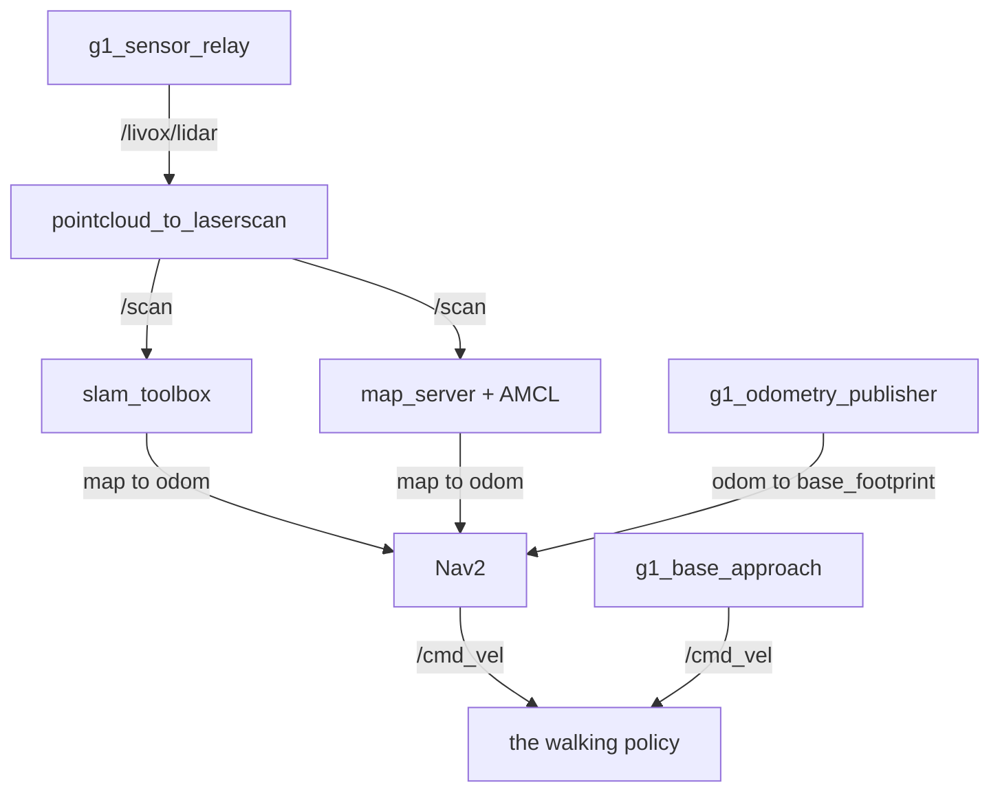

# g1_navigation

SLAM Toolbox mapping, AMCL localization and Nav2 for the G1 on the `unitree_mujoco` track.
Configuration, launch files and glue. Nav2 itself is upstream.

`ament_cmake`, Python launch files.



## Launch files

| File | Purpose |
|---|---|
| `nav_stack.launch.py` | The stack itself, with no simulator: the shared container, the scan pipeline, SLAM or localization, and Nav2 when asked. What `g1_bringup` includes. |
| `nav_sim.launch.py` | Standalone wrapper: a simulator, `nav_stack.launch.py`, and RViz. What the integration suites launch. |
| `scan.launch.py` | `pointcloud_to_laserscan`, flattening the LiDAR into the 2D scan SLAM and AMCL consume. |
| `slam.launch.py` | `slam_toolbox` in online async mapping mode. |
| `localization.launch.py` | `map_server` and AMCL against the committed map. |
| `nav2.launch.py` | Nav2 itself: planner, controller, behaviors, BT navigator, lifecycle manager. Composed by `nav_stack.launch.py` only when `nav:=true`. |

The operator entry point is `g1_bringup`'s. It stages the simulator itself and includes
`nav_stack.launch.py` directly, so nothing here bundles a simulator on its behalf.
`nav_sim.launch.py` is that same stack with a simulator and RViz attached, and it exposes
`use_composition`, `container_name` and `map`, which the bring-up entry point does not.

`nav_stack.launch.py` deliberately stages no simulator. Both callers stage exactly one, and a
second would put two writers on the low-level channel. `test_launch_threading` asserts the absence
rather than trusting it.

## Running

```bash
ros2 launch g1_bringup bringup.launch.py mode:=mapping rviz:=true
```

Drive it around with teleop and watch the map fill in. When it looks right:

```bash
ros2 run nav2_map_server map_saver_cli -f ~/facility
```

`maps/facility` is already committed, so that is only for a new scene. To navigate:

```bash
ros2 launch g1_bringup bringup.launch.py mode:=localization nav:=true rviz:=true

ros2 action send_goal /navigate_to_pose nav2_msgs/action/NavigateToPose \
  "{pose: {header: {frame_id: map}, pose: {position: {x: 2.5, y: -2.5}, orientation: {w: 1.0}}}}"
```

Everything here needs `sensors:=true`, which gates the LiDAR, the relay and the `odom` to
`base_footprint` chain. The navigation modes pass it for you.

## What the gait forces

The walking policy takes a velocity and returns a proportional fraction of it, with one property
Nav2 has to respect: a deadband below roughly 0.15 m/s on both linear axes. Commanded 0.10 m/s, the
robot does not move at all. Yaw has no deadband and tracks near 1:1. `g1_controllers` carries the
measured envelope.

That is the whole coupling. There is no shaper and no primitive set, so ordinary Nav2 tuning
applies. The one thing to check when changing a controller or a recovery is that its minimum speeds
clear the deadband rather than asking for motion the robot ignores. Reverse recovery is removed
from both behavior trees and from `behavior_plugins` for that reason: upstream's backup speed sits
inside the deadband.

Nav2 is not the only writer on the velocity channel. `nav2.launch.py` also starts `g1_locomotion`'s
`g1_base_approach`, which closes the last half metre under its own closed-loop control because
Nav2's 0.5 m goal tolerance is more than twice the arm's usable window. Nothing arbitrates between
them: the mission tree runs `NavigateToPose` and `ApproachObject` in sequence, never together. It
is launched unconditionally rather than gated on manipulation, because without `/objects` its goals
simply fail, and gating it on an argument this package knows nothing about would be worse coupling.

## Settings worth knowing before you change them

Nav2 runs uncomposed while the scan and localization nodes compose. Composed, the costmaps come up
on `Costmap2DROS` defaults instead of the params file, and `controller_server` then hangs forever
activating against a frame that does not exist. `use_composition:=true` raises with that
explanation rather than hanging.

`z_voxels` is 40, not upstream's 16, because the sensor sits at 1.22 m, outside a 0.8 m voxel
column.

`obstacle_max_range` is 3.0 m, well inside the sensor's reach. The limit is the estimate's
attitude, not its height: tilt times range is a height error, so an estimate that is exact
underfoot places floor returns centimetres high far away, and they cross `min_obstacle_height` and
mark as obstacle. The value came from bucketing floor returns by range over a real walk and
counting what crossed the cut. It is the simulator's number, so re-measure it the same way on the
robot rather than carrying it across.

AMCL uses `OmniMotionModel`, not differential. The robot strafes, both because
`g1_base_approach` commands lateral velocity and because the gait adds uncommanded lateral motion.
A differential model cannot express sideways motion at all and enters it into the filter as
rotation that never happened. The alphas are Nav2's defaults: tighter values only suit exact
simulator odometry, and `fast_lio` drifts.

## Configuration

| Path | Contents |
|---|---|
| `config/nav2_params.yaml` | Planner, controller, costmaps, behaviors, BT navigator. Every value is marked MEASURED or GUESS. |
| `config/localization.yaml` | `map_server` and AMCL. |
| `config/scan.yaml` | The point cloud to laser scan flatten, including the height band. |
| `config/slam_mapping.yaml` | `slam_toolbox` online async. |
| `config/g1_navigation.rviz` | RViz for the navigation modes. Fixed frame `map`. |
| `config/navigate_to_pose.xml`, `config/navigate_through_poses.xml` | Behavior trees, with reverse recovery removed. |
| `maps/facility.{yaml,pgm}` | The committed map of the navigation scene. |

`config/g1_navigation.rviz` holds everything in two toggleable groups: Nav2 (map, scan, AMCL
particle swarm, plans, both costmaps, footprints, the local voxel grid) and Sensors, which starts
folded away. `g1_bringup`'s `config/g1_sensors.rviz` is the counterpart for `mode:=none`: the same
Sensors group, no Nav2 group, and fixed frame `odom`, because there is no `map` frame without SLAM
or AMCL. They are two static files rather than one rewritten at launch, since they differ in fixed
frame as well as in which groups exist. The price is drift, which `test_rviz_configs` catches.

This RViz config lives here rather than in `g1_bringup` because the particle swarm is a
`nav2_rviz_plugins` display, and shipping it from the bring-up package would give that package a
Nav2 dependency.

## Tests

```bash
colcon test --packages-select g1_navigation
```

| Test | Needs a simulator | Covers |
|---|---|---|
| `test_navigate_to_pose` | yes | The acceptance gate: the robot reaches a goal on its own, stays upright, and never hands the joints to the emergency freeze while the perception stack shares the machine. |
| `test_scan_pipeline` | yes | The frame chain and the scan. |
| `test_slam_map` | yes | slam_toolbox owning `map` to `odom`, and the map's geometry. |
| `test_launch_threading` | no | Arguments surviving every include boundary, for both callers: the include set, the single container, the uncomposed Nav2 pin, and that no simulator is staged. |
| `test_rviz_configs` | no | The sensor display group not drifting between the two configs. |
| `test_no_sim_time` | no | No shipped config enables `use_sim_time`. There is no `/clock` on this track. |

`test_navigate_to_pose` drives the real gait with the whole perception stack running, so it is
timing-sensitive. There is deliberately no retry wrapper, because a retry would hide the rate.
Re-run it alone before believing a red run:

```bash
ctest --test-dir build/g1_navigation -R '^test_navigate_to_pose$'
```

## Soak test

`nav_soak` brings the stack up, drives a list of goals across the facility one at a time, records
health, and tears everything down.

```bash
ros2 run g1_navigation nav_soak                        # default goal list
ros2 run g1_navigation nav_soak --rviz
ros2 run g1_navigation nav_soak --goals "3.0 -3.0,-2.5 2.0"
```

It reports distance driven, how much of Nav2's output falls inside the gait's dead band, `map` to
`odom` correction sizes, pelvis pitch through the gait, and local costmap lethal-cell counts.
`nav_diag.py` is the recorder, and also runs on its own against a stack that is already up:

```bash
ros2 run g1_navigation nav_diag.py 200
```

Three details in `nav_soak` are load-bearing, and doing any of them the obvious way produces
results that look like stack defects. It sends one goal at a time and lets each finish, since
killing the action client mid-goal lets the next goal preempt the running one and the robot falls.
It tears down by process group and sweeps `/proc/PID/cmdline` rather than executable paths, because
anything running as `python3` or the `ros2` CLI otherwise survives as an orphan into the next run.
And it reads readiness from the launch log, because action and TF discovery can exceed any
reasonable timeout and AMCL only publishes `/amcl_pose` after a motion-gated update, so a
stationary robot never emits one.

Verify by hand that nothing survived:

```bash
ros2 node list --no-daemon | sort | uniq -d    # any output means an orphan is still running
```
