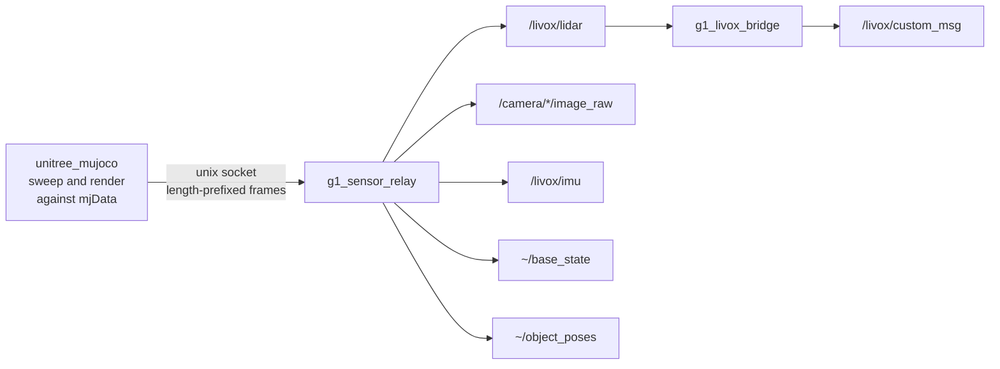

# g1_sensor_relay

Publishes the sensor data sampled inside the patched `unitree_mujoco`. The simulator computes the
LiDAR sweep and the camera render against its own `mjData` and hands finished frames over a local
socket; this node turns them into ROS 2 messages.

`ament_cmake`, C++20. Simulation only.



## Why the split exists

`unitree_sdk2` and `rmw_cyclonedds` both call `dds_create_domain` unconditionally, and CycloneDDS
allows exactly one explicit domain creation per domain id per process. They cannot coexist in
either order, so the simulator links no ROS at all and this node owns the ROS side.

The sweep itself has to happen inside the simulator because it needs the scene: geometry, meshes
and current pose all live in `mjData` in that process, and no DDS topic carries them. The finished
frame is what crosses the boundary.

## Topics

| Topic | Type | Notes |
|---|---|---|
| `/livox/lidar` | `sensor_msgs/msg/PointCloud2` | Sensor data QoS, so a reliable subscriber sees nothing. |
| `/camera/aligned_depth_to_color/image_raw` | `sensor_msgs/msg/Image` | `32FC1`, metres. Misses are NaN, not 0. |
| `/camera/color/image_raw` | `sensor_msgs/msg/Image` | `rgb8` |
| `/camera/aligned_depth_to_color/camera_info`, `/camera/color/camera_info` | `sensor_msgs/msg/CameraInfo` | Same intrinsics. |
| `/livox/imu` | `sensor_msgs/msg/Imu` | The IMU inside the Mid360, 200 Hz. Reliable, depth 10, matching the real driver. |
| `~/base_state` | `nav_msgs/msg/Odometry` | Exact pelvis state out of MuJoCo, for `g1_state_estimation`'s ground-truth source. Named apart from `/odom` because it is truth, not an estimate. |
| `~/object_poses` | `vision_msgs/msg/Detection3DArray` | Raw simulator ground truth. `g1_object_pose_source` is what turns it into `/objects`. |
| `~/sensor_pose` | `geometry_msgs/msg/PoseStamped` | Where the simulator says the sensor is. Diagnostic. |
| `/livox/custom_msg` | `livox_ros_driver2/msg/CustomMsg` | `g1_livox_bridge` only. Reliable, depth 20, matching the real driver. |

Depth and colour come from one render, so they share a pose, a timestamp and intrinsics by
construction. A real D435i only gets that alignment from its own align-depth-to-colour step, which
is why the depth topic is named as if it had run.

The optical frames are not `d435_link`. That is a body frame with x forward, and every depth
consumer assumes the optical convention with z forward, so publishing in the link frame rotates the
cloud 90 degrees.

## Parameters

| Parameter | Default | Meaning |
|---|---|---|
| `socket_path` | `/tmp/g1_sensors.sock` | Where the relay listens. The simulator connects to it. |
| `frame_id` | `mid360_link` | Frame for the point cloud. |
| `depth_frame_id` | `camera_depth_optical_frame` | REP-145 optical frame. |
| `color_frame_id` | `camera_color_optical_frame` | REP-145 optical frame. |
| `world_frame_id` | `world` | Frame for the diagnostic sensor pose. |
| `base_state_frame_id` / `base_state_odom_frame` | `pelvis` / `odom` | Frames stamped on `~/base_state`. |

`imu_topic` (`/livox/imu`) and `imu_frame_id` (`mid360_imu`) name the sensor's own IMU, and
`imu_rate_hz` in the simulator's sensor config sets its rate. `g1_livox_bridge` takes
`cloud_topic` and `custom_msg_topic`.

Start order does not matter. The relay listens whenever it comes up and the simulator retries every
cycle, so either process can start, die or restart independently.

## Running

```bash
ros2 launch g1_bringup bringup.launch.py sensors:=true rviz:=true
ros2 topic hz /livox/lidar
```

## g1_livox_bridge

A second executable, run only when FAST-LIO is asked for (`odometry:=fast_lio`, through
`g1_state_estimation`'s `fastlio_odometry.launch.py`). It restates the relay's PointCloud2 as the
Livox `CustomMsg` FAST-LIO consumes, one of the two topics `livox_ros_driver2` publishes on the
robot, so the odometry pipeline downstream is identical in both places. The other, `/livox/imu`,
comes off the socket above.

Every point goes out with `offset_time` zero. That is truthful rather than a shortcut: the
simulator raycasts the whole sweep against a frozen snapshot, so there is no motion inside a frame
for FAST-LIO's undistortion to undo. A real Mid360 sweeps continuously, which this bridge cannot
reproduce, so undistortion stays unvalidated until hardware.

## The Mid360's own IMU

FAST-LIO fuses the IMU that shares a housing with the laser, and the simulator models one there: a
MuJoCo site on `torso_link` at `g1_description`'s `mid360_imu` pose, sampled on its own thread at
200 Hz and sent over this socket. It cannot ride `/lowstate`, because `unitree_hg::LowState` carries
exactly one `imu_state`, matching a robot whose second IMU reports over the sensor's own Ethernet
link.

It must not be the pelvis IMU. Three waist joints lie between pelvis and sensor and the walking
policy drives all three, while FAST-LIO takes one constant lidar-to-IMU extrinsic, so no single
value is correct across that chain.

## Object poses are reported as the camera would see them

`~/object_poses` carries objects in `camera_color_optical_frame`, not in the simulator's world
frame. The simulator knows world poses; a detector knows what is in front of its lens, and
everything downstream is built for the latter. Converting here keeps that inside the sim-only
boundary, so `g1_object_pose_source` runs the same code on the robot.

The camera's world pose comes from the LiDAR sweep's own ground-truth pose composed with the rigid
LiDAR-to-camera transform, so it is one sweep stale. That is a few centimetres at walking pace, and
a truer model of a real detector than an exact answer would be.

## Layout

| File | Contents |
|---|---|
| `frame_reader.{hpp,cpp}` | Framing and validation, free of ROS and sockets so the wire format tests without a simulator. |
| `livox_custom_msg.{hpp,cpp}` | PointCloud2 to CustomMsg, split out so the conversion tests without a graph. |
| `g1_sensor_relay_node.cpp` | The socket, the poll loop and the publishers. |
| `g1_livox_bridge_node.cpp` | The FAST-LIO front end above. |
| `sensor_frame.h` | The wire struct, duplicated byte for byte on the simulator side. |

The wire format is untrusted input: every length is validated before it is trusted, including the
one multiply that could overflow.

## Tests

```bash
colcon test --packages-select g1_sensor_relay
```

`test_frame_reader` covers the framing, the bounds checks, and a drift check that reads both copies
of `sensor_frame.h`. `test_livox_custom_msg` covers the conversion against FAST-LIO's own discard
gates (`line`, the tag bits, `offset_time`) and the miss handling. Neither needs a simulator.
`g1_bringup`'s `test_lidar_geometry` asserts the published cloud measures the room it is in.
